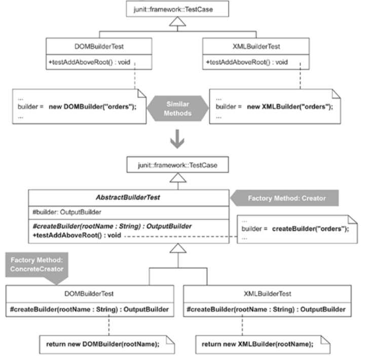

## Step 1
1. The similar method I first identify is the test method, testAddAboveRoot(). I exTRact its instantiation logic into an instantiation method like so:

public class DOMBuilderTest extends TestCase...
  
protected OutputBuilder createBuilder(String rootName) {
    
return new DOMBuilder(rootName);
  
}

  public void testAddAboveRoot() {
    String invalidResult =
    "<orders>" +
      "<order>" +
      "</order>" +
    "</orders>" +
    "<customer>" +
    "</customer>";
    builder = 
createBuilder("orders");
    builder.addBelow("order");
    try {
      builder.addAbove("customer");
      fail("expecting java.lang.RuntimeException");
    } catch (RuntimeException ignored) {}
  }

Notice that the return type for the new createBuilder(…) method is an OutputBuilder. I use that return type because the sibling subclass, XMLBuilderTest, will need to define its own createBuilder(…) method (in step 2) and I want the instantiation method's signature to be the same for both classes.

I compile and run my tests to ensure that everything's still working.

## Step2
2. Now I repeat step 1 for all other sibling subclasses, which in this case is just XMLBuilderTest:

public class XMLBuilderTest extends TestCase...
  
private OutputBuilder createBuilder(String rootName) {
    
return new XMLBuilder(rootName);
  
}

  public void testAddAboveRoot() {
    String invalidResult =
    "<orders>" +
      "<order>" +
      "</order>" +
    "</orders>" +
    "<customer>" +
    "</customer>";
    builder = 
createBuilder("orders");
    builder.addBelow("order");
    try {
      builder.addAbove("customer");
      fail("expecting java.lang.RuntimeException");
    } catch (RuntimeException ignored) {}
  }

I compile and test to make sure the tests still work.

## Step3
3. I'm now about to modify the superclass of my tests. But that superclass is TestCase, which is part of the JUnit framework. I don't want to modify that superclass, so I apply Extract Superclass [F] to produce AbstractBuilderTest, a new superclass for my test classes:

public class AbstractBuilderTest extends TestCase {

}

public class XMLBuilderTest 
extends AbstractBuilderTest...

public class DOMBuilderTest 
extends AbstractBuilderTest...

## Step4
4. I can now apply Form Template Method (205). Because the similar method is now identical in XMLBuilderTest and DOMBuilderTest, the Form Template Method mechanics I must follow instruct me to use Pull Up Method [F] on testAddAboveRoot(). Those mechanics first lead me to apply Pull Up Field [F] on the builder field:

public class AbstractBuilderTest extends TestCase {
  protected OutputBuilder builder;
}

public class XMLBuilderTest extends AbstractBuilderTest...
  

private OutputBuilder builder;

public class DOMBuilderTest extends AbstractBuilderTest...
  

private OutputBuilder builder;

Continuing with the Pull Up Method [F] mechanics for testAddAboveRoot(), I now find that I must declare an abstract method on the superclass for any method that is called by testAddAboveRoot() and present in the XMLBuilderTest and DOMBuilderTest. The method, createBuilder(…), is such a method, so I pull up an abstract method declaration of it:

public 
abstract class AbstractBuilderTest extends TestCase {
  protected OutputBuilder builder;

  
protected abstract OutputBuilder createBuilder(String rootName);
}

I can now proceed with pulling up testAddAboveRoot() to AbstractBuilderTest:

public abstract class AbstractBuilderTest extends TestCase...
  
public void testAddAboveRoot() {
    
String invalidResult =
    
"<orders>" +
      
"<order>" +
      
"</order>" +
    
"</orders>" +
    
"<customer>" +
    
"</customer>";
    
builder = createBuilder("orders");
    
builder.addBelow("order");
    
try {
      
builder.addAbove("customer");
      
fail("expecting java.lang.RuntimeException");
    
} catch (RuntimeException ignored) {}
  
}

That step removed testAddAboveRoot() from XMLBuilderTest and DOMBuilderTest. The createBuilder(…) method, which is now declared in AbstractBuilderTest and implemented in XMLBuilderTest and DOMBuilderTest, now implements the Factory Method [DP] pattern.

As always, I compile and test my tests to make sure that they still work.

## other steps
5. Since there are additional similar methods between XMLBuilderTest and DOMBuilderTest, I repeat steps 1–4 for each similar method.

6. At this point I consider creating a default implementation of createBuilder(…) in AbstractBuilderTest. I would only do this if it would help reduce duplication in the multiple subclass implementations of createBuilder(…). In this case, I don't have such a need because XMLBuilderTest and DOMBuilderTest each instantiate their own kind of OutputBuilder. So that brings me to the end of the refactoring.