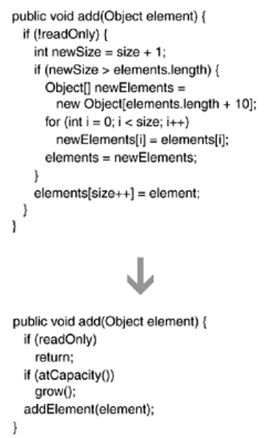

This example comes from a custom-written collections library. A List class contains an add(…) method by which a user can add an object to a List instance:

public class List...
   public void add(Object element) {
      if (!readOnly) {
         int newSize = size + 1;
         if (newSize > elements.length) {
            Object[] newElements =
               new Object[elements.length + 10];
            for (int i = 0; i < size; i++)
               newElements[i] = elements[i];
            elements = newElements;
         }
         elements[size++] = element;
      }
   }

The first thing I want to change about this 11-line method is its first conditional statement. Instead of using a conditional to wrap all of the method's code, I'd rather see the condition used as a guard clause, by which we can make an early exit from the method:

public class List...
   public void add(Object element) {
      
if (readOnly)
         
return;
      int newSize = size + 1;
      if (newSize > elements.length) {
         Object[] newElements =
            new Object[elements.length + 10];
         for (int i = 0; i < size; i++)
            newElements[i] = elements[i];
         elements = newElements;
      }
      elements[size++] = element;
   }

Next, I study the code in the middle of the method. This code checks to see whether the size of the elements array will exceed capacity if a new object is added. If capacity will be exceeded, the elements array is expanded by a factor of 10. The magic number 10 doesn't communicate very well at all. I change it to be a constant:

public class List...
   
private final static int GROWTH_INCREMENT = 10;

   public void add(Object element)...
      ...
      Object[] newElements =
         new Object[elements.length + 
GROWTH_INCREMENT];
      ...

Next, I apply Extract Method [F] on the code that checks whether the elements array is at capacity and needs to grow. This leads to the following code:

public class List...
   public void add(Object element) {
      if (readOnly)
         return;
      
if (atCapacity()) {
         Object[] newElements =
            new Object[elements.length + GROWTH_INCREMENT];
         for (int i = 0; i < size; i++)
            newElements[i] = elements[i];
         elements = newElements;
      }
      elements[size++] = element;
   }

   
private boolean atCapacity() {
      
return (size + 1) > elements.length;
   
}

Next, I apply Extract Method [F] on the code that grows the size of the elements array:

public class List...
   public void add(Object element) {
      if (readOnly)
         return;
      if (atCapacity())
         
grow();
      elements[size++] = element;
   }

   
private void grow() {
      
Object[] newElements =
         
new Object[elements.length + GROWTH_INCREMENT];
      
for (int i = 0; i < size; i++)
         
newElements[i] = elements[i];
      
elements = newElements;
   
}

Finally, I focus on the last line of the method:

elements[size++] = element;

Although this is one line of code, it is not at the same level of detail as the rest of the method. I fix this by extracting this code into its own method:

public class List...
   public void add(Object element) {
      if (readOnly)
         return;
      if (atCapacity())
         grow();
      
addElement(element);
   }

   
private void addElement(Object element) {
      
elements[size++] = element;
   
}

The add(…) method now contains only five lines of code. Before this refactoring, it would take a little time to understand what the method was doing. After this refactoring, I can rapidly understand what the method does in one second. This is a typical result of applying Compose Method.