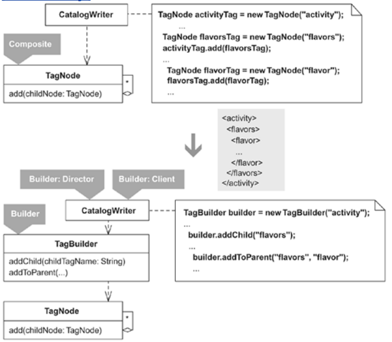
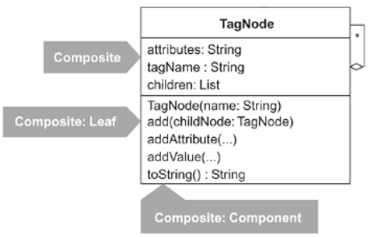

The Composite I'd like to encapsulate with a Builder is called TagNode. This class is featured in the refactoring Replace Implicit Tree with Composite (178). TagNode facilitates the creation of XML. It plays all three Composite roles because the TagNode class is a Component, which can be either a Leaf or a Composite at runtime, as shown in the following diagram.

TagNode's toString() method outputs an XML representation of all TagNode objects it contains. A TagBuilder will encapsulate TagNode, providing clients with a less repetitive and error-prone way to create a Composite of TagNode objects.

## step1
My first step is to create a builder that can successfully build one node. In this case, I want to create a TagBuilder that produces the correct XML for a tree containing a single TagNode. I begin by writing a failing test that uses assertXmlEquals, a method I wrote for comparing two pieces of XML:

public class TagBuilderTest...
  
public void testBuildOneNode() {
    
String expectedXml =
      
"<flavors/>";
    
String actualXml = new TagBuilder("flavors").toXml();
    
assertXmlEquals(expectedXml, actualXml);
  
}

Passing that test is easy. Here's the code I write:

public class TagBuilder {
  
private TagNode rootNode;

  
public TagBuilder(String rootTagName) {
    
rootNode = new TagNode(rootTagName);
  
}

  
public String toXml() {
    
return rootNode.toString();
  
}

}

The compiler and test code are happy with this new code.

## step2
Now I'll make TagBuilder capable of handling children. I want to deal with numerous scenarios, each of which causes me to write a different TagBuilder method.

I start with the scenario of adding a child to a root node. Because I want TagBuilder to both create a child node and position it correctly within the encapsulated Composite, I decide to produce one method for doing just that, called addChild(). The following test uses this method:

public class TagBuilderTest...
  
public void testBuildOneChild() {
    
String expectedXml =
      
"<flavors>"+
        
"<flavor/>" +
      
"</flavors>";

    
TagBuilder builder = new TagBuilder("flavors");
    
builder.addChild("flavor");
    
String actualXml = builder.toXml();

    
assertXmlEquals(expectedXml, actualXml);
  
}

Here are the changes I make to pass this test:

public class TagBuilder {
  private TagNode rootNode;
  
private TagNode currentNode;

  public TagBuilder(String rootTagName) {
    rootNode = new TagNode(rootTagName);
    
currentNode = rootNode;
  }
  
public void addChild(String childTagName) {
    
TagNode parentNode = currentNode;
    
currentNode = new TagNode(childTagName);
    
parentNode.add(currentNode);
  
}

  public String toXml() {
    return rootNode.toString();
  }
}

That was easy. To fully test that the new code works, I make an even harder test and see if it runs successfully:

public class TagBuilderTest...
  
public void testBuildChildrenOfChildren() {
    
String expectedXml =
      
"<flavors>"+
        
"<flavor>" +
          
"<requirements>" +
            
"<requirement/>" +
          
"</requirements>" +
        
"</flavor>" +
      
"</flavors>";

    
TagBuilder builder = new TagBuilder("flavors");
    
builder.addChild("flavor");
      
builder.addChild("requirements");
        
builder.addChild("requirement");
    
String actualXml = builder.toXml();

    
assertXmlEquals(expectedXml, actualXml);
  
}

The code passes this test as well. It's now time to handle another scenario—adding a sibling. Again, I write a failing test:

public class TagBuilderTest...
  
public void testBuildSibling() {
    
String expectedXml =
      
"<flavors>"+
        
"<flavor1/>" +
        
"<flavor2/>" +
      
"</flavors>";

    
TagBuilder builder = new TagBuilder("flavors");
    
builder.addChild("flavor1");
    
builder.addSibling("flavor2");
    
String actualXml = builder.toXml();

    
assertXmlEquals(expectedXml, actualXml);
  
}

Adding a sibling for an existing child implies that there is a way for TagBuilder to know who the common parent is for the child and its new sibling. There is currently no way to know this, as each TagNode instance doesn't store a reference to its parent. So I write the following failing test to drive the creation of this needed behavior:

public class TagNodeTest...
  
public void testParents() {
    
TagNode root = new TagNode("root");
    
assertNull(root.getParent());

    
TagNode childNode = new TagNode("child");
    
root.add(childNode);
    
assertEquals(root, childNode.getParent());
    
assertEquals("root", childNode.getParent().getName());
  
}

To pass this test, I add the following code to TagNode:

public class TagNode...
  
private TagNode parent;

  public void add(TagNode childNode) {
    
childNode.setParent(this);
    children().add(childNode);
  }

  
private void setParent(TagNode parent) {
    
this.parent = parent;
  
}

  
public TagNode getParent() {
    
return parent;
  
}

With the new functionality in place, I can refocus on writing code to pass the testBuildSibling() test, listed earlier. Here's the new code I write:

public class TagBuilder...
  public void addChild(String childTagName) {
    
addTo(currentNode, childTagName);
  }

  
public void addSibling(String siblingTagName) {
    
addTo(currentNode.getParent(), siblingTagName);
  
}

  
private void addTo(TagNode parentNode, String tagName) {
    
currentNode = new TagNode(tagName);
    
parentNode.add(currentNode);
  
}

Once again, the compiler and tests are happy with the new code. I write additional tests to confirm that sibling and child behavior works under various conditions.

Now I need to handle a final child-building scenario: the case when addChild() or addSibling() won't work because a child must be added to a specific parent. The test below indicates the problem:

public class TagBuilderTest...
  
public void testRepeatingChildrenAndGrandchildren() {
    
String expectedXml =
      
"<flavors>"+
        
"<flavor>" +
          
"<requirements>" +
            
"<requirement/>" +
          
"</requirements>" +
        
"</flavor>" +
        
"<flavor>" +
          
"<requirements>" +
            
"<requirement/>" +
          
"</requirements>" +
        
"</flavor>" +
      
"</flavors>";

    
TagBuilder builder = new TagBuilder("flavors");
    
for (int i=0; i<2; i++) {
      
builder.addChild("flavor");
        
builder.addChild("requirements");
          
builder.addChild("requirement");
    
}

    
assertXmlEquals(expectedXml, builder.toString());
  
}

The preceding test won't pass because it doesn't build what is expected. When the loop runs for the second time, the call to the builder's addChild() method picks up where it left off, meaning that it adds a child to the last added node, which produces the following incorrect result:

<flavors>
  <flavor>
    <requirements>
      <requirement/>
        
<flavor>   
 
Error: misplaced tags
          
<requirements>
            
<requirement/>
          
</requirements>
        
</flavor>
    </requirements>
  </flavor>
<flavors>

To fix this problem, I change the test to refer to a method I call addToParent(), which enables a client to add a new node to a specific parent:

public class TagBuilderTest...
  public void testRepeatingChildrenAndGrandchildren()...
    ...
    TagBuilder builder = new TagBuilder("flavors");
    for (int i=0; i<2; i++) {
      builder.
addToParent("flavors", "flavor");
        builder.addChild("requirements");
          builder.addChild("requirement");
    }
    assertXmlEquals(expectedXml, builder.toXml());

This test won't compile or run until I implement addToParent(). The idea behind addToParent() is that it will ask the TagBuilder's currentNode if its name matches the supplied parent name (passed via a parameter). If the name matches, the method will add a new child node to currentNode, or if the name doesn't match, the method will ask for currentNode's parent and continue the process until either a match is found or a null parent is encountered. The pattern name for this behavior is Chain of Responsibility [DP].

To implement the Chain of Responsibility, I write the following new code in TagBuilder:

public class TagBuilder...
  
public void addToParent(String parentTagName, String childTagName) {
    
addTo(findParentBy(parentTagName), childTagName);
  
}

  private void addTo(TagNode parentNode, String tagName) {
    currentNode = new TagNode(tagName);
    parentNode.add(currentNode);
  }

  
private TagNode findParentBy(String parentName) {
    
TagNode parentNode = currentNode;
    
while (parentNode != null) {
      
if (parentName.equals(parentNode.getName()))
        
return parentNode;
      
parentNode = parentNode.getParent();
    
}
    
return null;
  
}

The test passes. Before I move on, I want addToParent() to deal with the case where the name supplied for a parent node does not exist. So I write the following test:

public class TagBuilderTest...
  
public void testParentNameNotFound() {
    
TagBuilder builder = new TagBuilder("flavors");
    
try {
      
for (int i=0; i<2; i++) {
        
builder.addToParent("favors", "flavor");  
 
should be "flavors" not "favors"
        
builder.addChild("requirements");
        
builder.addChild("requirement");
      
}
      
fail("should not allow adding to parent that doesn't exist.");
    
} catch (RuntimeException runtimeException) {
      
String expectedErrorMessage = "missing parent tag: favors";
      
assertEquals(expectedErrorMessage, runtimeException.getMessage());
    
}
  
}

I make this test pass by making the following modifications to TagBuilder:

public class TagBuilder...
  public void addToParent(String parentTagName, String childTagName) {
    
TagNode parentNode = findParentBy(parentTagName);
    
if (parentNode == null)
      
throw new RuntimeException("missing parent tag: " + parentTagName);
    addTo(
parentNode, childTagName);
  }
  
## step 3-4
Now I make TagBuilder capable of adding attributes and values to nodes. This is an easy step because the encapsulated TagNode already handles attributes and values. Here's a test that checks to see whether both attributes and values are handled correctly:

public class TagBuilderTest...
  
public void testAttributesAndValues() {
    
String expectedXml =
      
"<flavor name='Test-Driven Development'>" +     
 
tag with attribute
        
"<requirements>" +
          
"<requirement type='hardware'>" +
              
"1 computer for every 2 participants" +  
 
tag with value
            
"</requirement>" +
          
"<requirement type='software'>" +
              
"IDE" +

          
"</requirement>" +
        
"</requirements>" +
      
"</flavor>";
    
TagBuilder builder = new TagBuilder("flavor");
    
builder.addAttribute("name", "Test-Driven Development");
      
builder.addChild("requirements");
        
builder.addToParent("requirements", "requirement");
        
builder.addAttribute("type", "hardware");
        
builder.addValue("1 computer for every 2 participants");
        
builder.addToParent("requirements", "requirement");
        
builder.addAttribute("type", "software");
        
builder.addValue("IDE");

    
assertXmlEquals(expectedXml, builder.toXml());
  
}

The following new methods make the test pass:

public class TagBuilder...
  
public void addAttribute(String name, String value) {
    
currentNode.addAttribute(name, value);
  
}

  
public void addValue(String value) {
    
currentNode.addValue(value);
  
}

4. Now it's time to reflect on how simple TagBuilder is and how easy it is for clients to use. Is there a simpler way to produce XML? This is not the kind of question you can normally answer right away. Experiments and hours, days, or weeks of reflection can sometimes yield a simpler idea. I'll discuss a simpler implementation in the Variations section below. For now, I move on to the last step.

## step5
 I conclude the refactoring by replacing Composite-construction code with code that uses the TagBuilder. I'm not aware of any easy way to do this; Composite-construction code can span large parts of a system. Hopefully you have test code to catch you if you make any mistakes during the transformation. Here's a method on a class called CatalogWriter that must be changed from using TagNode to using TagBuilder:

public class CatalogWriter...
  public String catalogXmlFor(Activity activity) {
    TagNode activityTag = new TagNode("activity");
    ...
    TagNode flavorsTag = new TagNode("flavors");
    activityTag.add(flavorsTag);
    for (int i=0; i < activity.getFlavorCount(); i++) {
      TagNode flavorTag = new TagNode("flavor");
      flavorsTag.add(flavorTag);
      Flavor flavor = activity.getFlavor(i);
      ...
      int requirementsCount = flavor.getRequirements().length;
      if (requirementsCount > 0) {
        TagNode requirementsTag = new TagNode("requirements");
        flavorTag.add(requirementsTag);
        for (int r=0; r < requirementsCount; r++) {
          Requirement requirement = flavor.getRequirements()[r];
          TagNode requirementTag = new TagNode("requirement");
          ...
          requirementsTag.add(requirementTag);
        }
      }
    }
    return activityTag.toString();
  }

This code works with the domain objects Activity, Flavor, and Requirement, as shown in the following diagram.

 

You may wonder why this code creates a Composite of TagNode objects just to render Activity data into XML, rather than simply asking Activity, Flavor, and Requirement instances to render themselves into XML via their own toXml() method. That's a fine question to ask, for if domain objects already form a Composite structure, it may not make any sense to form another Composite structure, like activityTag, just to render the domain objects into XML. In this case, however, producing the XML externally from the domain objects makes sense because the system that uses these domain objects must produce several XML representations of them, all of which are quite different. A single toXml() method for every domain object wouldn't work well here—each implementation of the method would need to produce too many different XML representations of the domain object.

After transforming the catalogXmlFor(…) method to use a TagBuilder, it looks like this:

public class CatalogWriter...
  private String catalogXmlFor(Activity activity) {
    
TagBuilder builder = new TagBuilder("activity");
    
...
    
builder.addChild("flavors");
    for (int i=0; i < activity.getFlavorCount(); i++) {
      
builder.addToParent("flavors", "flavor");
      Flavor flavor = activity.getFlavor(i);
      ...
      int requirementsCount = flavor.getRequirements().length;
      if (requirementsCount > 0) {
        
builder.addChild("requirements");
        for (int r=0; r < requirementsCount; r++) {
          Requirement requirement = flavor.getRequirements()[r];
          
builder.addToParent("requirements", "requirement");
          ...
        }
      }
    }
    return 
builder.toXml();
  }

And that does it for this refactoring! TagNode is now fully encapsulated by TagBuilder.
