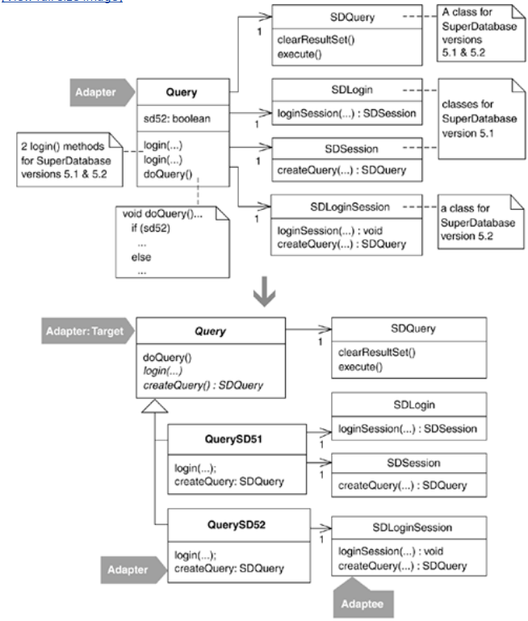

## step1
The code I'll refactor in this example, which was depicted in the code sketch at the beginning of this refactoring, is based on real-world code that handles queries to a database using a third-party library. To protect the innocent, I've renamed that library SD, which stands for SuperDatabase.

1. I begin by identifying an Adapter that is overburdened with support for multiple versions of SuperDatabase. This class, called Query, provides support for SuperDatabase versions 5.1 and 5.2.

In the following code listing, notice the version-specific instance variables, duplicate login() methods, and conditional code in doQuery():

public class Query...
   private SDLogin sdLogin; // needed for SD version 5.1
   private SDSession sdSession; // needed for SD version 5.1
   private SDLoginSession sdLoginSession; // needed for SD version 5.2
   private boolean sd52; // tells if we're running under SD 5.2
   private SDQuery sdQuery; // this is needed for SD versions 5.1 & 5.2

   // this is a login for SD 5.1
   // NOTE: remove this when we convert all aplications to 5.2
   public void login(String server, String user, String password) throws QueryException {
      sd52 = false;
      try {
         sdSession = sdLogin.loginSession(server, user, password);
      } catch (SDLoginFailedException lfe) {
         throw new QueryException(QueryException.LOGIN_FAILED,
                                  "Login failure\n" + lfe, lfe);
      } catch (SDSocketInitFailedException ife) {
         throw new QueryException(QueryException.LOGIN_FAILED,
                                  "Socket fail\n" + ife, ife);
      }
   }

   // 5.2 login
   public void login(String server, String user, String password,
                     String sdConfigFileName) throws QueryException {
      sd52 = true;
      sdLoginSession = new SDLoginSession(sdConfigFileName, false);
      try {
         sdLoginSession.loginSession(server, user, password);
      } catch (SDLoginFailedException lfe) {
         throw new QueryException(QueryException.LOGIN_FAILED,
                                  "Login failure\n" + lfe, lfe);
      } catch (SDSocketInitFailedException ife) {
         throw new QueryException(QueryException.LOGIN_FAILED,
                                  "Socket fail\n" + ife, ife);
      } catch (SDNotFoundException nfe) {
         throw new QueryException(QueryException.LOGIN_FAILED,
                                  "Not found exception\n" + nfe, nfe);
      }
   }

   public void doQuery() throws QueryException {
      if (sdQuery != null)
         sdQuery.clearResultSet();
      if (sd52)
         sdQuery = sdLoginSession.createQuery(SDQuery.OPEN_FOR_QUERY);
      else
         sdQuery = sdSession.createQuery(SDQuery.OPEN_FOR_QUERY);
      executeQuery();
   }
   
