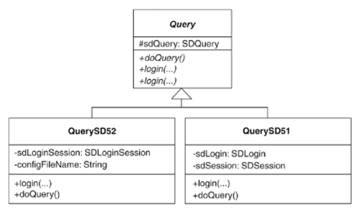

## step1
The code I'll refactor in this example, which was depicted in the code sketch at the beginning of this refactoring, is based on real-world code that handles queries to a database using a third-party library. To protect the innocent, I've renamed that library SD, which stands for SuperDatabase.

1. I begin by identifying an Adapter that is overburdened with support for multiple versions of SuperDatabase. This class, called Query, provides support for SuperDatabase versions 5.1 and 5.2.

In the following code listing, notice the version-specific instance variables, duplicate login() methods, and conditional code in doQuery():

public class Query...
   private SDLogin sdLogin; // needed for SD version 5.1
   private SDSession sdSession; // needed for SD version 5.1
   private SDLoginSession sdLoginSession; // needed for SD version 5.2
   private boolean sd52; // tells if we're running under SD 5.2
   private SDQuery sdQuery; // this is needed for SD versions 5.1 & 5.2

   // this is a login for SD 5.1
   // NOTE: remove this when we convert all aplications to 5.2
   public void login(String server, String user, String password) throws QueryException {
      sd52 = false;
      try {
         sdSession = sdLogin.loginSession(server, user, password);
      } catch (SDLoginFailedException lfe) {
         throw new QueryException(QueryException.LOGIN_FAILED,
                                  "Login failure\n" + lfe, lfe);
      } catch (SDSocketInitFailedException ife) {
         throw new QueryException(QueryException.LOGIN_FAILED,
                                  "Socket fail\n" + ife, ife);
      }
   }

   // 5.2 login
   public void login(String server, String user, String password,
                     String sdConfigFileName) throws QueryException {
      sd52 = true;
      sdLoginSession = new SDLoginSession(sdConfigFileName, false);
      try {
         sdLoginSession.loginSession(server, user, password);
      } catch (SDLoginFailedException lfe) {
         throw new QueryException(QueryException.LOGIN_FAILED,
                                  "Login failure\n" + lfe, lfe);
      } catch (SDSocketInitFailedException ife) {
         throw new QueryException(QueryException.LOGIN_FAILED,
                                  "Socket fail\n" + ife, ife);
      } catch (SDNotFoundException nfe) {
         throw new QueryException(QueryException.LOGIN_FAILED,
                                  "Not found exception\n" + nfe, nfe);
      }
   }

   public void doQuery() throws QueryException {
      if (sdQuery != null)
         sdQuery.clearResultSet();
      if (sd52)
         sdQuery = sdLoginSession.createQuery(SDQuery.OPEN_FOR_QUERY);
      else
         sdQuery = sdSession.createQuery(SDQuery.OPEN_FOR_QUERY);
      executeQuery();
   }
   
## step2
Because Query doesn't already have subclasses, I decide to apply Extract Subclass [F] to isolate code that handles SuperDatabase 5.1 queries. My first step is to define the subclass and create a constructor for it:

class QuerySD51 extends Query {
   
public QuerySD51() {
      
super();
   
}

}

Next, I find all client calls to Query's constructor and, where appropriate, change the code to call the QuerySD51 constructor. For example, I find the following client code, which holds onto a Query field called query:

public void loginToDatabase(String db, String user, String password)...
   query = new Query();
   try   {
      if (usingSDVersion52()) {
         query.login(db, user, password, getSD52ConfigFileName());  // Login to SD 5.2
      } else {
         query.login(db, user, password); // Login to SD 5.1
      }
      ...
   } catch(QueryException qe)...

I change this to:

public void loginToDatabase(String db, String user, String password)...
   

query = new Query();
   try   {
      if (usingSDVersion52()) {
         
query = new Query();
         query.login(db, user, password, getSD52ConfigFileName()); // Login to SD 5.2
      } else {
         
query = new QuerySD51();
         query.login(db, user, password);  // Login to SD 5.1
      }
      ...
   } catch(QueryException qe) {

Next, I apply Push Down Method [F] and Push Down Field [F] to outfit QuerySD51 with the methods and instance variables it needs. During this step, I have to be careful to consider the clients that make calls to public Query methods, for if I move a public method like login() from Query to QuerySD51, the caller will not be able to call the public method unless its type is changed to QuerySD51. Because I don't want to make such changes to client code, I proceed cautiously, sometimes copying and modifying public methods instead of completely removing them from Query. While I do this, I generate duplicate code, but that doesn't bother me now—I'll get rid of the duplication in the final step of this refactoring.

class Query...
   

private SDLogin sdLogin;
   

private SDSession sdSession;
   
protected SDQuery sdQuery;

   // this is a login for SD 5.1
   
public void login(String server, String user, String password) throws QueryException {
      
// I make this a do-nothing method
   
}

   public void doQuery() throws QueryException {
      if (sdQuery != null)
         sdQuery.clearResultSet();
      

if (sd52)
      sdQuery = sdLoginSession.createQuery(SDQuery.OPEN_FOR_QUERY);
      

else
         

sdQuery = sdSession.createQuery(SDQuery.OPEN_FOR_QUERY);
      executeQuery();
   }

class QuerySD51 {
   
private SDLogin sdLogin;
   
private SDSession sdSession;

   
public void login(String server, String user, String password) throws QueryException {
      

sd52 = false;
      
try {
         
sdSession = sdLogin.loginSession(server, user, password);
      
} catch (SDLoginFailedException lfe) {
         
throw new QueryException(QueryException.LOGIN_FAILED,
                                  
"Login failure\n" + lfe, lfe);
      
} catch (SDSocketInitFailedException ife) {
         
throw new QueryException(QueryException.LOGIN_FAILED,
                                  
"Socket fail\n" + ife, ife);
      
}
   
}

   public void doQuery() throws QueryException {
      if (sdQuery != null)
         sdQuery.clearResultSet();
      

if (sd52)
         

sdQuery = sdLoginSession.createQuery(SDQuery.OPEN_FOR_QUERY);
      

else
      
sdQuery = sdSession.createQuery(SDQuery.OPEN_FOR_QUERY);
      executeQuery();
   }
}

I compile and test that QuerySD51 works. No problems.

## step3
Next, I repeat step 2 to create QuerySD52. Along the way, I can make the Query class abstract, along with the doQuery() method. Here's what I have now:

Query is now free of version-specific code, but it is not free of duplicate code.

## step4
Now I go on a mission to remove duplication. I quickly find some in the two implementations of doQuery():

abstract class Query...
   public abstract void doQuery() throws QueryException;

class QuerySD51...
   public void doQuery() throws QueryException {
      
if (sdQuery != null)
         
sdQuery.clearResultSet();

      
sdQuery = sdSession.createQuery(SDQuery.OPEN_FOR_QUERY);
      
executeQuery();
   }

class QuerySD52...
   public void doQuery() throws QueryException {
      
if (sdQuery != null)
         
sdQuery.clearResultSet();

      
sdQuery = sdLoginSession.createQuery(SDQuery.OPEN_FOR_QUERY);
      
executeQuery();
   }

Each of these methods simply initializes the sdQuery instance in a different way. This means that I can apply Introduce Polymorphic Creation with Factory Method (88) and Form Template Method (205) to create a single superclass version of doQuery():

public abstract class Query...
   
protected abstract SDQuery createQuery();         // a Factory Method [DP]

   
public void doQuery() throws QueryException {     // a Template Method [DP]
      
if (sdQuery != null)
         
sdQuery.clearResultSet();
      
sdQuery = createQuery();                    // call to the Factory Method
      
executeQuery();
   
}

class QuerySD51...
   
protected SDQuery createQuery() {
      
return sdSession.createQuery(SDQuery.OPEN_FOR_QUERY);
   
}

class QuerySD52...
   
protected SDQuery createQuery() {
      
return sdLoginSession.createQuery(SDQuery.OPEN_FOR_QUERY);
   
}

After compiling and testing the changes, I now face a more obvious duplication problem: Query still contains the SD 5.1 and 5.2 login() methods, even though they no longer do anything (the real login work is now handled by the subclasses). The signatures for these two login() method are identical, except for one parameter:

// SD 5.1 login
public void login(String server, String user, String password) throws QueryException...

// SD 5.2 login
public void login(String server, String user,
                  String password, 
String sdConfigFileName) throws QueryException...

I decide to make the login() signatures the same, by simply supplying QuerySD52 with the sdConfigFileName information via its constructor:

class QuerySD52...
   
private String sdConfigFileName;
   
public QuerySD52(String sdConfigFileName) {
      
super();
      
this.sdConfigFileName = sdConfigFileName;
   
}

Now Query has only one abstract login() method:

abstract class Query...
   public abstract void login(String server, String user,
                              String password) throws QueryException...

Client code is updated as follows:

public void loginToDatabase(String db, String user, String password)...
   
if (usingSDVersion52())
      
query = new QuerySD52(getSD52ConfigFileName());
   
else
      
query = new QuerySD51();

   try   {
      
query.login(db, user, password);
      ...
   } catch(QueryException qe)...

I'm nearly done. Because Query is an abstract class, I decide to rename it AbstractQuery, which communicates more about its nature. But making that name change necessitates changing client code to declare variables of type AbstractQuery instead of Query. I don't want to do that, so I apply Extract Interface [F] on AbstractQuery to obtain a Query interface that AbstractQuery can implement:

interface Query {
   
public void login(String server, String user, String password) throws QueryException;
   
public void doQuery() throws QueryException;

}

abstract class 
AbstractQuery 
implements Query...
   

public abstract void login(String server, String user,
                              

String password) throws QueryException…

Now, subclasses of AbstractQuery implement login(), while AbstractQuery doesn't even need to declare the login() method because it is an abstract class.

I compile and test to see that everything works as planned. Each version of SuperDatabase is now fully adapted. The code is smaller and treats each version in a more uniform way, all of which makes it easier to:

See similarities and differences between the versions

Remove support for older, unused versions

Add support for newer versions