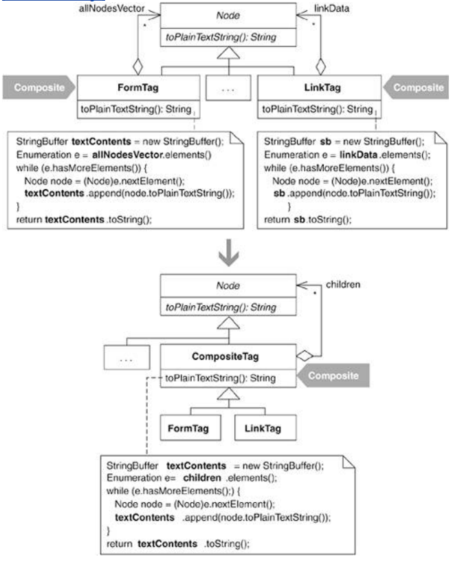

In Extract Superclass [F], Martin Fowler explains that if you have two or more classes with similar features, it makes sense to move the common features to a superclass. This refactoring is similar: it addresses the case when the similar feature is a Composite [DP] that would be better off in a superclass.

This refactoring occurred on the open-source HTML Parser (see http://sourceforge.net/projects/htmlparser). When the parser parses a piece of HTML, it identifies and creates objects representing HTML tags and pieces of text. For example, here's some HTML:

<HTML>
   <BODY>
      Hello, and welcome to my Web page! I work for
      
   </BODY>
</HTML>

Given such HTML, the parser would create objects of the following types:

Tag (for the <BODY> tag)

StringNode (for the String, "Hello, and welcome . . .")

LinkTag (for the <A HREF="…"> tag)

Because the link tag (<A HREF="…">) contains an image tag (), you might wonder what the parser does with it. The image tag, which the parser treats as an ImageTag, is treated as a child of the LinkTag. When the parser notices that the link tag contains an image tag, it constructs and gives one ImageTag object as a child to the LinkTag object.

Additional tags in the parser, such as FormTag, TitleTag, and others, are also child containers. As I studied some of these classes, it didn't take long to spot duplicate code for storing and handling child nodes. For example, consider the following:

public class LinkTag extends Tag...
   private Vector nodeVector;

   public String toPlainTextString() {
      StringBuffer sb = new StringBuffer();
      Node node;
      for (Enumeration e=linkData();e.hasMoreElements();) {
         node = (Node)e.nextElement();
         sb.append(node.toPlainTextString());
      }
      return sb.toString();
   }

public class FormTag extends Tag...
   protected Vector allNodesVector;

   public String toPlainTextString() {
      StringBuffer stringRepresentation = new StringBuffer();
      Node node;
      for (Enumeration e=getAllNodesVector().elements();e.hasMoreElements();) {
         node = (Node)e.nextElement();
         stringRepresentation.append(node.toPlainTextString());
      }
      return stringRepresentation.toString();
   }

Because FormTag and LinkTag both contain children, they both have a Vector for storing children, though it goes by a different name in each class. Both classes need to support the toPlainTextString() operation, which outputs the non-HTML-formatted text of the tag's children, so both classes contain logic to iterate over their children and produce plain text. Yet the code to do this operation is nearly identical in these classes! In fact, there are several nearly identical methods in the child-container classes, all of which reek of duplication. So follow along as I apply Extract Composite to this code.

## step1
I must first create an abstract class that will become the superclass of the child-container classes. Because the child-container classes, like LinkTag and FormTag, are already subclasses of Tag, I create the following class:

public abstract class CompositeTag extends Tag {
   
public CompositeTag(
      
int tagBegin,
      
int tagEnd,
      
String tagContents,
      
String tagLine) {
      
super(tagBegin, tagEnd, tagContents, tagLine);
   
}

}

## step2
Now I make the child containers subclasses of CompositeTag:

public class LinkTag extends 
CompositeTag

public class FormTag extends 
CompositeTag

// and so on...

Note that for the remainder of this refactoring, I'll show code from only two child containers, LinkTag and FormTag, even though there are others in the code base.
