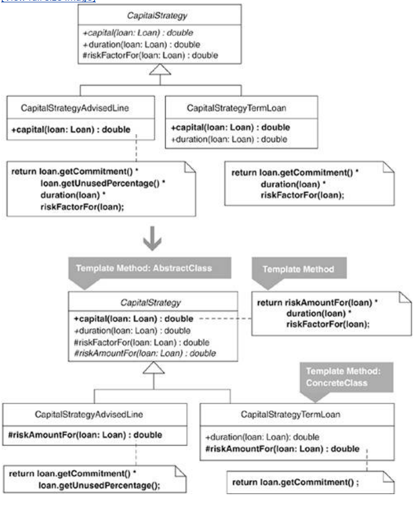
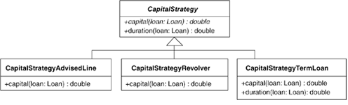

At the end of the example used in this catalog for the refactoring Replace Conditional Logic with Strategy (129) there are three subclasses of the abstract class, CapitalStrategy:

These three subclasses happen to contain a small amount of duplication, which, as we'll see in this section, can be removed by applying Form Template Method. It is relatively common to combine the Strategy and Template Method patterns to produce concrete Strategy classes that have little or no duplicate code in them.

The CapitalStrategy class defines an abstract method for the capital calculation:

public abstract class CapitalStrategy...
   public abstract double capital(Loan loan);

Subclasses of CapitalStrategy calculate capital similarly:

public class CapitalStrategyAdvisedLine...
   public double capital(Loan loan) {
      return loan.getCommitment() * loan.getUnusedPercentage() *
             duration(loan) * riskFactorFor(loan);
   }

public class CapitalStrategyRevolver...
   public double capital(Loan loan) {
      return (loan.outstandingRiskAmount() * duration(loan) * riskFactorFor(loan))
           + (loan.unusedRiskAmount() * duration(loan) * unusedRiskFactor(loan));
   }

public class CapitalStrategyTermLoan...
   public double capital(Loan loan) {
      return loan.getCommitment() * duration(loan) * riskFactorFor(loan);
   }
   protected double duration(Loan loan) {
      return weightedAverageDuration(loan);
   }
   private double weightedAverageDuration(Loan loan)...

I observe that CapitalStrategyAdvisedLine's calculation is identical to CapitalStrategyTermLoan's calculation, except for a step that multiplies the result by the loan's unused percentage (loan.getUnusedPercentage()). Spotting this similar sequence of steps with a slight variation means I can generalize the algorithm by refactoring to Template Method. I'll do that in the following steps and then deal with the third class, CapitalStrategyRevolver, at the end of this Example section.

## step1 
The capital(…) method implemented by CapitalStrategyAdvisedLine and CapitalStrategyTermLoan is the similar method in this example.

The mechanics direct me to apply Compose Method (123) on the capital() implementations by extracting identical methods or unique methods. Since the formulas in capital() are identical except for CapitalStrategyAdvisedLine's step of multiplying by loan.getUnusedPercentage(), I must choose whether to extract that step into its own unique method or extract it as part of a method that includes other code. The mechanics work either way. In this case, several years of programming loan calculators for a bank aids me in making a decision. The risk amount for an advised line is calculated by multiplying the loan's commitment amount by its unused percentage (i.e., loan.getCommitment() * loan.getUnusedPercentage()). In addition, I know the standard formula for risk-adjusted capital:

Risk Amount x Duration x Risk Factor

That knowledge leads me to extract the CapitalStrategyAdvisedLine code, loan.getCommitment() * loan.getUnusedPercentage(), into its own method, riskAmountFor(), while performing a similar step for CapitalStrategyTermLoan:

public class CapitalStrategyAdvisedLine...
   public double capital(Loan loan) {
      return 
riskAmountFor(loan) * duration(loan) * riskFactorFor(loan);
   }
   
private double riskAmountFor(Loan loan) {
      
return loan.getCommitment() * loan.getUnusedPercentage();
   
}

public class CapitalStrategyTermLoan...
   public double capital(Loan loan) {
      return 
riskAmountFor(loan) * duration(loan) * riskFactorFor(loan);
   }
   
private double riskAmountFor(Loan loan) {
      
return loan.getCommitment();
   
}

Domain knowledge clearly influenced my refactoring decisions during this step. In his book Domain-Driven Design [Evans], Eric Evans describes how domain knowledge often directs what we choose to refactor or how we choose to refactor it.

## step2-4
This step asks me to pull up identical methods to the superclass, CapitalStrategy. In this case, the riskAmountFor(…) method is not an identical method because the code in each implementation of it varies, so I can move on to the next step.

3. Now I must ensure that any unique methods have the same signature in each subclass. The only unique method, riskAmountFor(…), already has the same signature in each subclass, so I can proceed to the next step.

4. I must now ensure that the similar method, capital(…), has the same signature in both subclasses. It does, so I proceed to the next step.

## step5
Because the capital(…) method in each subclass now has the same signature and body, I can pull it up to CapitalStrategy by applying Pull Up Method [F]. This involves declaring an abstract method for the unique method, riskAmountFor(…):

public abstract class CapitalStrategy...
   

public abstract double capital(Loan loan);
   
public double capital(Loan loan) {
      
return riskAmountFor(loan) * duration(loan) * riskFactorFor(loan);
   
}
   
public abstract double riskAmountFor(Loan loan);

The capital() method is now a Template Method. That completes the refactoring for the CapitalStrategyAdvisedLine and CapitalStrategyTermLoan subclasses.

Before I handle the capital calculation in CapitalStrategyRevolver, I'd like to show what would have happened had I not created a riskAmountFor(…) method during step 1 of the refactoring. In that case, I would have created a unique method for CapitalStrategyAdvisedLine's step of multiplying by loan.getUnusedPercentage(). I would have called such a step unusedPercentageFor(…) and implemented it as a hook method in CapitalStrategy:

public abstract class CapitalStrategy...
   public double capital(Loan loan) {
      return loan.getCommitment() * unusedPercentageFor(loan) *
             duration(loan) * riskFactorFor(loan);
   }
   public abstract double riskAmountFor(Loan loan);

   protected double unusedPercentageFor(Loan loan) {  // hook method
      return 1.0
   };

Because this hook method returns 1.0, it has no effect on calculations unless the method is overridden, as it is by CapitalStrategyAdvisedLine:

public class CapitalStrategyAdvisedLine...
   protected double unusedPercentageFor(Loan loan) {
      return loan.getUnusedPercentage();
   };

The hook method allows CapitalStrategyTermLoan to inherit its capital(…) calculation, rather than implement a riskAmount(…) method:

public class CapitalStrategyTermLoan...
   

public double capital(Loan loan) {
      

return loan.getCommitment() * duration(loan) * riskFactorFor(loan);
   

}
   protected double duration(Loan loan) {
      return weightedAverageDuration(loan);
   }
   private double weightedAverageDuration(Loan loan)...

So that is another way to produce a Template Method for the capital() calculation. However, it suffers from a few downsides:

The resulting code poorly communicates the risk-adjusted capital formula (Risk Amount x Duration x Risk Factor).

Two of the three CapitalStrategy subclasses, CapitalStrategyTermLoan and, as we'll see, CapitalStrategyRevolver, inherit the hook method's do-nothing behavior, which, because it is a unique step in CapitalStrategyAdvisedLine, really belongs exclusively in that class.

Now let's see how CapitalStrategyRevolver would take advantage of the new capital() Template Method. Its original capital() method looks like this:

public class CapitalStrategyRevolver...
   public double capital(Loan loan) {
      return (loan.outstandingRiskAmount() * duration(loan) * riskFactorFor(loan))
         + (loan.unusedRiskAmount() * duration(loan) * unusedRiskFactor(loan));
   }

The first half of the formula resembles the general formula, Risk Amount x Duration x Risk Factor. The second half of the formula is similar, but it's dealing with the unused portion of a loan. We can refactor this code to take advantage of the Template Method as follows:

public class CapitalStrategyRevolver...
   public double capital(Loan loan) {
      return
         
super.capital(loan)
         + (loan.unusedRiskAmount() * duration(loan) * unusedRiskFactor(loan));
   }

   
protected double riskAmountFor(Loan loan) {
      
return loan.outstandingRiskAmount();
   
}

You could argue whether this new implmentation is easier to understand than the previous one. Certainly some duplication in the formula has been removed. Yet is the resulting formula easier to follow? I think so, because it communicates that capital is calculated according to the general formula with the addition of unused capital. The addition of unused capital can be made clearer by applying Extract Method [F] on capital():

public class CapitalStrategyRevolver...
   public double capital(Loan loan) {
      return super.capital(loan) 
+ unusedCapital(loan);
   }
   
public double unusedCapital(Loan loan) {
      
return loan.unusedRiskAmount() * duration(loan) * unusedRiskFactor(loan);
   
}