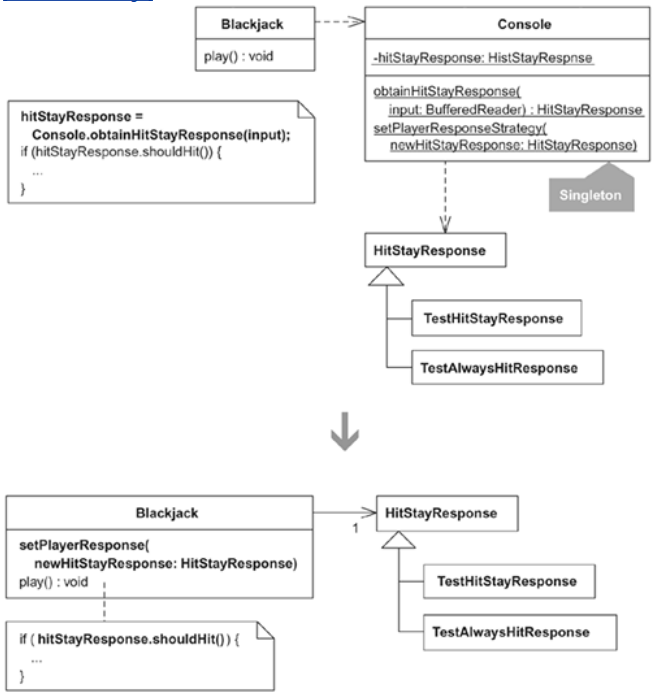

A player's simulated input is specified and obtained at runtime from a Singleton called Console, which holds on to one instance of HitStayResponse or one of its subclasses:

public class Console {
  static private HitStayResponse hitStayResponse =
    new HitStayResponse();

  private Console() {
    super();
  }

  public static HitStayResponse obtainHitStayResponse(BufferedReader input) {
    hitStayResponse.readFrom(input);
    return hitStayResponse;
  }

  public static void setPlayerResponse(HitStayResponse newHitStayResponse) {
    hitStayResponse = newHitStayResponse;
  }
}

Prior to starting game play, a particular HitStayResponse is registered with the Console. For example, here's some test code that registers a TestAlwaysHitResponse instance with the Console:

public class ScenarioTest extends TestCase...
  public void testDealerStandsWhenPlayerBusts() {
    
Console.setPlayerResponse(new TestAlwaysHitResponse());
    int[] deck = { 10, 9, 7, 2, 6 };
    Blackjack blackjack = new Blackjack(deck);
    blackjack.play();
    assertTrue("dealer wins", blackjack.didDealerWin());
    assertTrue("player loses", !blackjack.didPlayerWin());
    assertEquals("dealer total", 11, blackjack.getDealerTotal());
    assertEquals("player total", 23, blackjack.getPlayerTotal());
  }

The Blackjack code that calls the Console to obtain the registered HitStayResponse instance isn't complicated code. Here's how it looks:

public class Blackjack...
  public void play() {
    deal();
    writeln(player.getHandAsString());
    writeln(dealer.getHandAsStringWithFirstCardDown());
    HitStayResponse hitStayResponse;
    do {
      write("H)it or S)tay: ");
      hitStayResponse = 
Console.obtainHitStayResponse(input);
      write(hitStayResponse.toString());
      if (hitStayResponse.shouldHit()) {
        dealCardTo(player);
        writeln(player.getHandAsString());
     }
    }
    while (canPlayerHit(hitStayResponse));
    // ...
  }

The above code doesn't live in an application layer that's surrounded by other application layers, thereby making it hard to pass one HitStayResponse instance all the way to a layer that needs it. All of the code to access a HitStayResponse instance lives within Blackjack itself. So why should Blackjack have to go through a Console just to get to a HitStayResponse? It shouldn't! It's yet another Singleton that doesn't need to be a Singleton. Time to refactor.

