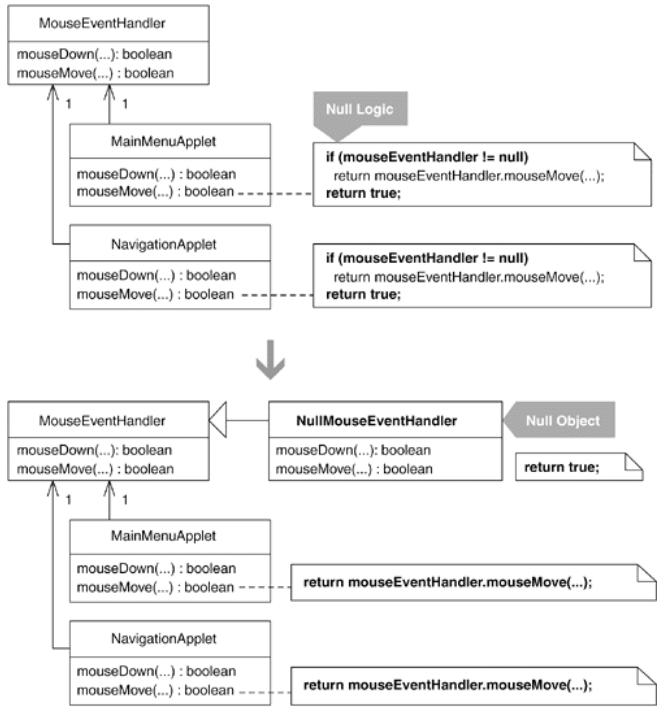

The code worked perfectly except for one problem. During start-up, our applets would load into a browser window and initialize themselves. Part of the initialization process included getting MouseEventHandler objects instantiated and configured. To inform each MouseEventHandler instance about which areas of an applet were clickable and what Commands to run when those areas were clicked, we needed to read data and pass it to each instance. While loading that data didn't take a lot of time, it did leave a window of time in which our Mouse EventHandler instances weren't ready to receive mouse events. If a user happened to move or click the mouse on an applet before our custom mouse event handlers were fully instantiated and configured, the browser would bark errors onto the console and the applets would become unstable.

There was an easy fix: find every place where MouseEventHandler instances could be called when they were still null (i.e., not yet instantiated) and write code to insulate them from such calls. This solved the start-up problem, yet we were unhappy with the new design. Now, numerous classes in our system featured an abundance of null checks:

public class NavigationApplet extends Applet...
  public boolean mouseMove(Event event, int x, int y) {
    
if (mouseEventHandler != null)
      return mouseEventHandler.mouseMove(graphicsContext, event, x, y );
    
return true;
  }

  public boolean mouseDown(Event event, int x, int y) {
    
if (mouseEventHandler != null)
      return mouseEventHandler.mouseDown(graphicsContext, event, x, y );
    
return true;
  }

  public boolean mouseUp(Event event, int x, int y) {
    
if (mouseEventHandler != null)
      return mouseEventHandler.mouseUp(graphicsContext, event, x, y );
    
return true;
  }

  public boolean mouseExit(Event event, int x, int y) {
    
if (mouseEventHandler != null)
      return mouseEventHandler.mouseExit(graphicsContext, event, x, y );
    
return true;
  }

To remove the null checks, we refactored the applets so they used a NullMouseEventHandler at start-up and then switched to using a MouseEventHandler instance when one was ready. Here are the steps we followed to make this change.

## step1-3
We applied Extract Subclass [F] to define NullMouseEventHandler, a subclass of our own mouse event handler:

public class NullMouseEventHandler extends MouseEventHandler {
  
public NullMouseEventHandler(Context context) {
    
super(context);
  
}

}

That code compiled just fine, so we moved on.

2. Next, we found a null check, like this one:

public class NavigationApplet extends Applet...
  public boolean mouseMove(Event event, int x, int y) {
    if (mouseEventHandler != null)  
// null check
      return mouseEventHandler.mouseMove(graphicsContext, event, x, y);
    return true;
  }

The method invoked in the above null check is mouseEventHandler.mouseMove(…). The code invoked if mouseEventHandler equals null is the code that the mechanics direct us to implement in an overridden mouseMove(…) method on NullMouseEventHandler. That was easily implemented:

public class NullMouseEventHandler...
  
public boolean mouseMove(MetaGraphicsContext mgc, Event event, int x, int y) {

    
return true;
  
}

The new method compiled with no problems.

3. We repeated step 2 for all other occurrences of the null check in our code. We found the null check in numerous methods on three different classes. When we completed this step, NullMouseEventHandler had many new methods. Here are a few of them:

public class NullMouseEventHandler...
  
public boolean mouseDown(MetaGraphicsContext mgc, Event event, int x, int y) {
    
return true;
  
}

  
public boolean mouseUp(MetaGraphicsContext mgc, Event event, int x, int y) {
    
return true;
  
}

  
public boolean mouseEnter(MetaGraphicsContext mgc, Event event, int x, int y) {
    
return true;
  
}

  
public void doMouseClick(String imageMapName, String APID) {
  
}

The above code compiled with no difficulties.

## step1-3
We applied Extract Subclass [F] to define NullMouseEventHandler, a subclass of our own mouse event handler:

public class NullMouseEventHandler extends MouseEventHandler {
  
public NullMouseEventHandler(Context context) {
    
super(context);
  
}

}

That code compiled just fine, so we moved on.

2. Next, we found a null check, like this one:

public class NavigationApplet extends Applet...
  public boolean mouseMove(Event event, int x, int y) {
    if (mouseEventHandler != null)  
// null check
      return mouseEventHandler.mouseMove(graphicsContext, event, x, y);
    return true;
  }

The method invoked in the above null check is mouseEventHandler.mouseMove(…). The code invoked if mouseEventHandler equals null is the code that the mechanics direct us to implement in an overridden mouseMove(…) method on NullMouseEventHandler. That was easily implemented:

public class NullMouseEventHandler...
  
public boolean mouseMove(MetaGraphicsContext mgc, Event event, int x, int y) {

    
return true;
  
}

The new method compiled with no problems.

3. We repeated step 2 for all other occurrences of the null check in our code. We found the null check in numerous methods on three different classes. When we completed this step, NullMouseEventHandler had many new methods. Here are a few of them:

public class NullMouseEventHandler...
  
public boolean mouseDown(MetaGraphicsContext mgc, Event event, int x, int y) {
    
return true;
  
}

  
public boolean mouseUp(MetaGraphicsContext mgc, Event event, int x, int y) {
    
return true;
  
}

  
public boolean mouseEnter(MetaGraphicsContext mgc, Event event, int x, int y) {
    
return true;
  
}

  
public void doMouseClick(String imageMapName, String APID) {
  
}

The above code compiled with no difficulties.

## step4-6
Then we initialized mouseEventHandler, the field referenced in the null check within the NavigationApplet class, to an instance of the NullMouseEventHandler:

public class NavigationApplet extends Applet...
  private MouseEventHandler mouseEventHandler 
= new NullMouseEventHandler(null);

The null that was passed to the NullMouseEventHandler's constructor forwarded to the constructor of its superclass, MouseEventHandler. Because we didn't like passing such nulls around, we altered NullMouseEventHandler's constructor to do this work:

public class NullMouseEventHandler extends MouseEventHandler {
  public NullMouseEventHandler(

Context context) {
    
super(null);
  }
}

public class NavigationApplet extends Applet...
  private MouseEventHandler mouseEventHandler 
= new NullMouseEventHandler();

5. Next came the fun part. We deleted all occurrences of the null check in such classes as NavigationApplet:

public class NavigationApplet extends Applet...
  public boolean mouseMove(Event event, int x, int y) {
    

if (mouseEventHandler != null)
      return mouseEventHandler.mouseMove(graphicsContext, event, x, y );
    

return true;
  }

  public boolean mouseDown(Event event, int x, int y) {
    

if (mouseEventHandler != null)
      return mouseEventHandler.mouseDown(graphicsContext, event, x, y);
    

return true;
  }

  public boolean mouseUp(Event event, int x, int y) {
    

if (mouseEventHandler != null)
      return mouseEventHandler.mouseUp(graphicsContext, event, x, y);
    

return true;
  }

  // etc.

After doing that, we compiled and tested whether the changes worked. In this case, we had no automated tests, so we had to run the Web site in a browser and try repeatedly to cause problems with our mouse as the NavigationApplet applet started up and began running. Everything worked well.

6. We repeated steps 4 and 5 for other classes that featured the same null check until it had been completely eliminated from all classes that originally contained it.

Because our system used only two instances of the NullMouseEventHandler, we did not make it a Singleton [DP].