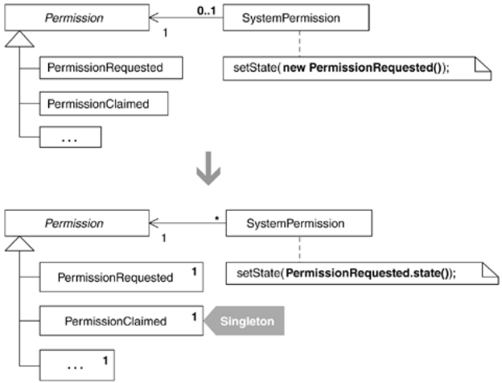

If you want to be a good software designer, don't optimize code prematurely. Prematurely optimized code is harder to refactor than code that hasn't been optimized. In general, you'll discover more alternatives for improving your code before it has been optimized than after.

If you use the Singleton [DP] pattern out of habit, because it "makes your code more efficient," you're prematurely optimizing. You suffer from Singletonitis and had better follow the advice in Inline Singleton (114). On the other hand, sometimes it's a good decision to refactor to a Singleton, as in the following scenario.

Users of your system are complaining about system performance.

Your profiler tells you that you can improve performance by not instantiating certain objects over and over again.

The objects you want to share have no state or contain state that is sharable.

A colleague and I profiled a system that handles security permissions. The system uses the State [DP] pattern (see Replace State-Altering Conditionals with State, 166). Every state transition leads to the instantiation of a new State object. We profiled the system to check memory usage and performance. While the instantiation of State objects wasn't the biggest bottleneck in the system, it did contribute to slow performance under a heavy load.

Based on this research, we determined that it made sense to refactor to a Singleton in order to limit the instantiation of stateless State objects. And that's the general idea behind this refactoring: wait for a good reason to limit instantiation and when you find one, then refactor to a Singleton. Of course, we profiled after implementing the Singleton, and memory usage was much improved.

For other reasons to refactor to a Singleton that don't involve improving performance, see the wise words provided by Kent Beck, Ward Cunningham, and Martin Fowler earlier in this catalog at Inline Singleton (114).

This example is based on the security code example found in the refactoring Replace State-Altering Conditionals with State (166). If you study the code produced after applying that refactoring, you'll find that each State instance is a Singleton. However, these Singleton State instances weren't created for performance reasons; they resulted from performing the refactoring Replace Type Code with Class (286).

When I initially refactored to the State pattern on the security code project, I did not apply Replace Type Code with Class (286). I wasn't yet aware of how much that refactoring simplifies the later steps in refactoring to the State pattern. My earlier approach to the State refactoring involved instantiating Permission subclasses each time they were needed, paying no regard to the Singleton pattern.

On that project, my colleague and I profiled our code and found several places where it could be optimized. One of those places involved the frequent instantiation of the state classes. So, as part of an overall effort to improve performance, the code to repeatedly instantiate the Permission subclasses was refactored to use the Singleton pattern. I describe the steps here.

## step1-3
There are six State classes, each of which is a multiple instance class because clients instantiate them multiple times. In this example, I'll work with the PermissionRequested class, which looks like this:

public class PermissionRequested extends Permission {
   public static final String NAME= "REQUESTED";

   public String name() {
      return NAME;
   }

   public void claimedBy(SystemAdmin admin, SystemPermission permission) {
      permission.willBeHandledBy(admin);
      permission.setState(new PermissionClaimed());
   }
}

PermissionRequested doesn't define a constructor because it uses Java's default constructor. Because the first step in the mechanics is to convert its constructor(s) to Creation Methods, I define a Creation Method like so:

public class PermissionRequested extends Permission...
   
public static Permission state() {
      
return new PermissionRequested();
   
}

You'll notice that I use Permission as the return type for this Creation Method. I do that because I want all client code to interact with State subclasses via the interface of their superclass. I also update all callers of the constructor to now call the Creation Method:

public class SystemPermission...
   private Permission state;
   public SystemPermission(SystemUser requestor, SystemProfile profile) {
      this.requestor = requestor;
      this.profile = profile;
      

state = new PermissionRequested();
      
state = PermissionRequested.state();
      ...
   }

I compile and test to make sure that this trivial change didn't break anything.

2. Now I create the singleton field, a private static field of type Permission in PermisionRequested, and initialize it to an instance of PermissionRequested:

public class PermissionRequested extends Permission...
   
private static Permission state = new PermissionRequested();

I compile to confirm that my syntax is correct.

3. Finally, I change the Creation Method, state(), to return the value in the state field:

public class PermissionRequested extends Permission...
   public static Permission state() {
      
return state;
}

I compile and test once again and everything works. I now repeat these steps for the remaining State classes until all of them are Singletons. At that point, I run the profiler to check how memory usage and performance have been affected. Hopefully, things have improved. If not, I may decide to undo these steps, as I'd always rather work with regular objects than Singletons.