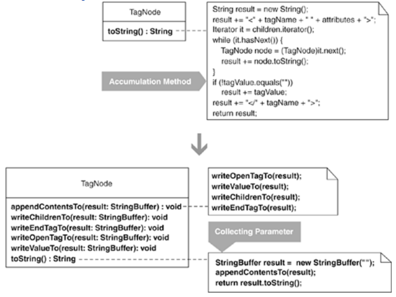

A Collecting Parameter is an object that you pass to methods in order to collect information from those methods. This pattern is often coupled with Composed Method [Beck, SBPP] (see the refactoring Compose Method, 123).

## step1
In this example, I'll show you how to refactor Composite-based code to use a Collecting Parameter. I'll start with a Composite that can model an XML tree (see Replace Implicit Tree with Composite, 178 for a complete example).

The Composite is modeled with a single class, called TagNode, which has a toString() method. The toString() method recursively walks the nodes in an XML tree and produces a final String representation of what it finds. It does a fair amount of work in 11 lines of code. In the steps presented here, I refactor toString() to make it simpler and easier to understand.

1. The following toString() method recursively accumulates information from every tag in a Composite structure and stores results in a variable called result:

class TagNode...
   public String toString() {
      String result = new String();
      result += "<" + tagName + " " + attributes + ">";
      Iterator it = children.iterator();
      while (it.hasNext()) {
         TagNode node = (TagNode)it.next();
         result += node.toString();
      }
      if (!value.equals(""))
         result += value;
      result += "</" + tagName + ">";
      return result;
   }

I change result's type to be a StringBuffer:

StringBuffer result = new StringBuffer("");

The compiler is happy with this change.

## step2
I identify the first information accumulation step: code that concatenates an XML open tag along with any attributes to the result variable. I apply Extract Method [F] on this code as follows, so that this line:

result += "<" + tagName + " " + attributes + ">";

is extracted to:

private void writeOpenTagTo(StringBuffer result) {
  
result.append("<");
  
result.append(name);
  
result.append(attributes.toString());
  
result.append(">");

}

The original code now looks like this:

StringBuffer result = new StringBuffer("");

writeOpenTagTo(result);
...

I compile and test to confirm that everything is OK.