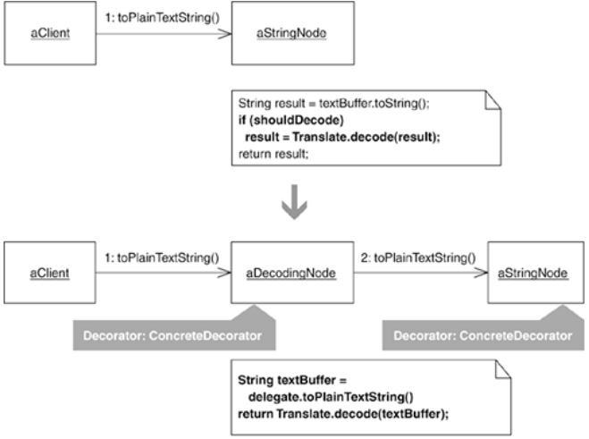
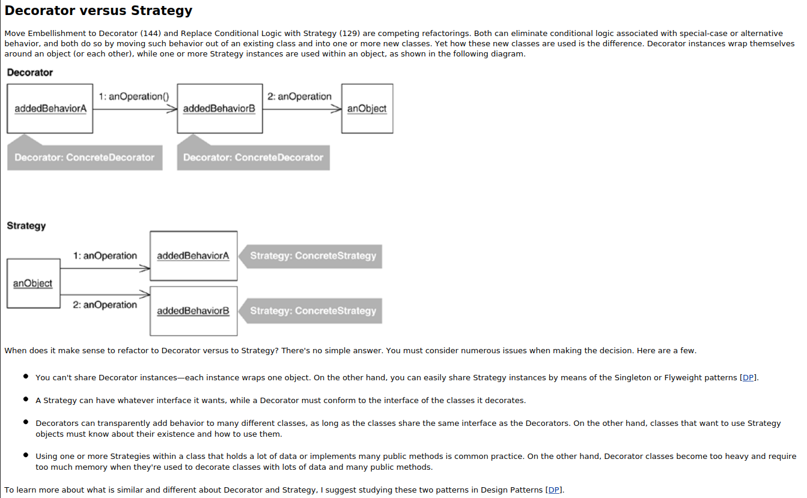
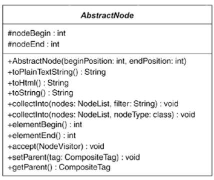
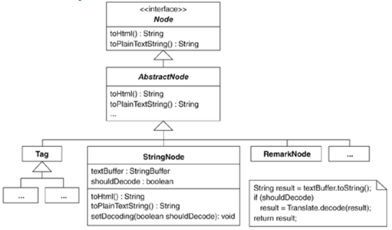
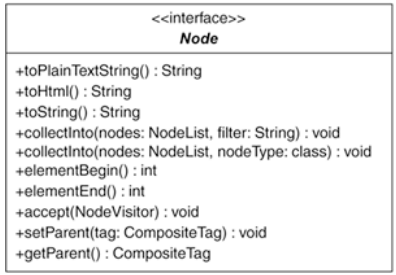
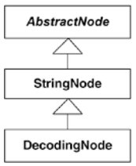
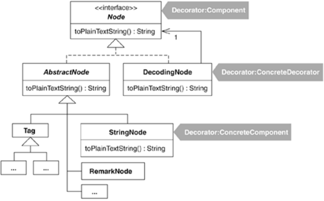

When new features in a system are needed, it's common to add new code to old classes. Such new code often embellishes the core responsibility or primary behavior of an existing class. The trouble with some of these embellishments is that they complicate their host classes with new fields, new methods, and new logic, all of which exists for special-case behavior that needs to be executed only some of the time.

The Decorator pattern [DP] offers a good remedy: place each embellishment in its own class and let that class wrap the type of object it needs to embellish so that clients may wrap the embellishment around objects at runtime, when special-case behavior is needed.

The open source HTML Parser (http://sourceforge.net/projects/htmlparser) allows programs to see the contents of HTML files as specific HTML objects. When the parser encounters tag data or strings sandwiched between tag data, it translates what it finds into the appropriate HTML objects, like Tag, StringNode, EndTag, ImageTag, and so forth. The parser is frequently used to:

Translate the contents of one HTML file to another

Report information about a piece of HTML

Verify the contents of HTML

The Move Embellishment to Decorator refactoring we'll look at concerns the parser's StringNode class. Instances of this class are created at runtime when the parser finds chunks of text sandwiched between tags. For example, consider this HTML:

<BODY>This text will be recognized as a StringNode</BODY>

Given this line of HTML, the parser creates the following objects at runtime:

Tag (for the <BODY> tag)

StringNode (for the String, "This text will be recognized as a StringNode")

EndTag (for the </BODY> tag)

There are a few ways to examine the contents of HTML objects: you can obtain the object's plain-text representation using toPlainTextString(), and you can obtain the object's HTML representation using toHtml(). In addition, some classes in the parser, including StringNode, implement getText() and setText() methods. Yet a call to a StringNode instance's getText() method returns the same plain-text representation that calls to toPlainTextString() and toHtml() return. So why are there three methods for obtaining the same value? It's a typical story of programmers adding new code to classes based on current needs without refactoring existing code to remove duplication. In this case, it's likely that getText() and toPlainTextString() could be consolidated into one method. In this example, I defer that refactoring work until I learn more about why this consolidation wasn't already performed.

A common embellishment to StringNode involves decoding "numeric or character entity references" found in StringNode instances. Typical character reference decodings include the following:

&amp;

decoded to

&

&divide;

decoded to

÷

&lt;

decoded to

<

&rt;

decoded to

>

The parser's translate class has a method called decode(String dataToDecode) that can decode a comprehensive set of numeric and character entity references. Such decoding is an embellishment often applied to StringNode instances after they've been found by the parser. For example, consider the following test code, which parses a fragment of HTML and then iterates through a collection of Node instances, decoding the nodes that are instances of StringNode:

public void testDecodingAmpersand() throws Exception {
   String ENCODED_WORKSHOP_TITLE =
      "The Testing &amp; Refactoring Workshop";

   String DECODED_WORKSHOP_TITLE =
      "The Testing & Refactoring Workshop";

   assertEquals(
      "ampersand in string",
      DECODED_WORKSHOP_TITLE,
      parseToObtainDecodedResult(ENCODED_WORKSHOP_TITLE));
}

private String parseToObtainDecodedResult(String STRING_TO_DECODE)
   throws ParserException {

   StringBuffer decodedContent = new StringBuffer();
   createParser(STRING_TO_DECODE);

   NodeIterator nodes = parser.elements();
   while (nodes.hasMoreNodes()) {
      Node node = nodes.nextNode();
      if (node instanceof StringNode) {
         StringNode stringNode = (StringNode) node;
         decodedContent.append(
            
Translate.decode(stringNode.toPlainTextString())); // decoding step
      }
      if (node instanceof Tag)
         decodedContent.append(node.toHtml());
   }
   return decodedContent.toString();
}

Decoding character and numeric references in StringNode instances is a feature that clients need only some of the time. Yet these clients always perform the decoding themselves, using the same process of iterating nodes, finding nodes that are StringNode instances, and decoding them. Instead of forcing these clients to perform the same decoding steps over and over again, the work could be consolidated in one place by building this decoding behavior into the parser.

I thought of several ways to go about this refactoring and then settled on a straightforward approach: add the decoding embellishment directly to StringNode and observe how the code looks afterward. I had some doubts about this implementation, but I wanted to see how far I could push it until a better design was needed. So, using test-driven development, I added the decoding embellishment to StringNode. This work involved updating test code, changing the Parser class, changing the StringParser class (which instantiates StringNodes) and changing StringNode.

Here's how I updated the above test to drive the creation of this decoding embellishment:

public void testDecodingAmpersand() throws Exception {
   String ENCODED_WORKSHOP_TITLE =
   "The Testing &amp; Refactoring Workshop";

   String DECODED_WORKSHOP_TITLE =
   "The Testing & Refactoring Workshop";

   StringBuffer decodedContent = new StringBuffer();
   Parser parser = Parser.createParser(ENCODED_WORKSHOP_TITLE);
   
parser.setNodeDecoding(true);  // tell parser to decode StringNodes
   NodeIterator nodes = parser.elements();

   while (nodes.hasMoreNodes())
      decodedContent.append(nodes.nextNode().toPlainTextString());

   assertEquals("decoded content",
      DECODED_WORKSHOP_TITLE,
      decodedContent.toString()
   );
}

True to the nature of test-driven development, this updated code wouldn't even compile until I added the code necessary for parser.setNodeDecoding(true). My first step was to extend the Parser class to include a flag for toggling StringNode decoding on or off:

public class Parser...
   
private boolean shouldDecodeNodes = false;

   
public void setNodeDecoding(boolean shouldDecodeNodes) {
      
this.shouldDecodeNodes = shouldDecodeNodes;
   
}

Next, the StringParser class needed some changes. It contains a method called find(…) that locates, instantiates, and returns StringNode instances during parsing. Here's a fragment of the code:

public class StringParser...
   public Node find(NodeReader reader, String input, int position, boolean balance_quotes) {

     ...
     return new StringNode(textBuffer, textBegin, textEnd);
   }

I also changed this code to support the new decoding option:

public class StringParser...
   public Node find(NodeReader reader, String input, int position, boolean balance_quotes) {
                        ...
      return new StringNode(
         textBuffer, textBegin, textEnd, 
reader.getParser().shouldDecodeNodes());
   }

That code wouldn't compile until I added to the Parser class the shouldDecodeNodes() method and created a new StringNode constructor that would take the boolean value supplied by shouldDecodeNodes():

[View full width]

public class Parser...
   
public boolean shouldDecodeNodes() {
      
return shouldDecodeNodes;
   
}

public class StringNode extends Node...
   
private boolean shouldDecode = false;

   
public StringNode(StringBuffer textBuffer, int textBegin, int textEnd, boolean

 shouldDecode) {
      
this(textBuffer, textBegin, textEnd);
      
this.shouldDecode = shouldDecode;
   
}

Finally, to complete the implementation and make the test pass, I needed to write decoding logic in StringNode:

public class StringNode...
   public String toPlainTextString() {
      String result = textBuffer.toString();
      
if (shouldDecode)
         
result = Translate.decode(result);
      return result;
   }

My tests were now passing. I observed that the parser's new decoding embellishment didn't unduly bloat the code. Yet once you support one embellishment, it's often easy to find others worth supporting. And sure enough, when I looked over more parser client code, I found that it was common to remove escape characters (like \n for newline, \t for tabs) from StringNode instances. So I decided to give the parser an embellishment to remove escape characters as well. Doing that meant adding another flag to the Parser class (which I called shouldRemoveEscapeCharacters), updating StringParser to call a StringNode constructor that could handle both the decoding option and the new option for removing escape characters, and adding the following new code to StringNode:

public class StringNode...
   
private boolean shouldRemoveEscapeCharacters = false;

   
public StringNode(StringBuffer textBuffer, int textBegin, int textEnd,
                     
boolean shouldDecode, boolean shouldRemoveEscapeCharacters) {
      
this(textBuffer, textBegin, textEnd);
      
this.shouldDecode = shouldDecode;
      
this.shouldRemoveEscapeCharacters = shouldRemoveEscapeCharacters;
   
}

   public String toPlainTextString() {
      String result = textBuffer.toString();
      if (shouldDecode)
         result = Translate.decode(result);
      
if (shouldRemoveEscapeCharacters)
         
result = ParserUtils.removeEscapeCharacters(result);
      return result;
   }

The embellishments for decoding and escape character removal simplified client code to the parser. But I didn't like the number of changes I was forced to make across several parser classes just to support each new embellishment. Making such changes across multiple classes was an indication of the code smell Solution Sprawl (43). This smell resulted from:

Too much initialization logic, that is, code to tell Parser and StringParser to toggle an embellishment on or off and to initialize StringNode instances to use one or more embellishments

Too much embellishment logic, that is, special-case logic in StringNode to support each embellishment

I reasoned that the initialization problem could best be solved by handing the parser a Factory instance that instantiated the appropriately configured StringNode instances at runtime (see Move Creation Knowledge to Factory, 68). I further reasoned that the buildup of embellishment logic could be solved by refactoring to either a Decorator or a Strategy. I decided to revisit the initialization problem later and focus on the Decorator or Strategy refactoring now.

So which pattern would be more useful here? As I explored sibling classes of StringNode (such as RemarkNode, which represents a comment in HTML), I saw that they could also benefit from the decoding and escape character removal behavior now in StringNode. If I refactored that behavior into Strategy classes, then StringNode and its sibling classes would need to be altered to know about the Strategy classes. This would not be necessary with a Decorator implementation because the behavior in Decorators could be transparently wrapped around instances of StringNode and its siblings. That appealed to me; I did not like the idea of changing a lot of code in many classes.

What about performance? I did not give much consideration to performance because I tend to let a profiler lead me to performance problems. I further reasoned that if the Decorator refactoring led to slow performance, it wouldn't require much work to refactor it to a Strategy implementation.

Having decided that a Decorator would be better than a Strategy, I now needed to decide whether a Decorator would really be a good fit for the code in question. As I mentioned at the beginning of the Mechanics section, it's vital to learn whether a class is primitive enough to make decoration viable. Primitive, in this case, means that the class doesn't implement a large number of public methods or declare many fields. I discovered that StringNode is primitive, but its superclass, AbstractNode, is not. The diagram on the following page shows AbstractNode.

I counted ten public methods on AbstractNode. That's not exactly what I'd call a narrow interface, but it isn't broad either. I decided it's small enough to do this refactoring.

Getting ready to refactor, my goal now is to get the embellishment logic out of StringNode by putting each embellishment into its own StringNode Decorator class. If there is ever a need to support multiple embellishments, it will be possible to configure combinations of StringNode Decorators prior to executing a parse.

The following diagram illustrates where StringNode fits into the Node hierarchy and how its decoding logic looked before it was refactored to use a DecodingNode Decorator.

Here are the steps for refactoring StringNode's decoding logic to a Decorator.

## step 1
My first step is to identify or create an enclosure type, a class or interface that declares all public methods of StringNode and whatever public methods it inherits. A good enclosure type won't contain fields (i.e., state). So StringNode's superclass, AbstractNode, is not a good enclosure type because it contains the two primitive int fields, nodeBegin and nodeEnd. Why does it matter whether a class contains fields? Decorators add behavior to the objects they decorate, but they don't need duplicate copies of the fields in those objects. In this case, because StringNode already inherits nodeBegin and nodeEnd from AbstractNode, Decorators of StringNode don't also need to inherit those fields.

So I rule out AbstractNode as the enclosure type. The next natural place to look is the interface that AbstractNode implements, which is called Node. The following diagram shows this interface.

This would be the perfect enclosure type, except that it doesn't include StringNode's two public methods, getText() and setText(…). I must add these methods to the Node interface in order to pave the way for creating a transparent enclosure for StringNode. I'm not happy about this step, for it means expanding the interface of Node just to accommodate this refactoring. However, I proceed anyway, knowing that a future refactoring will combine toPlainTextString() and getText(), thereby reducing the size of the Node interface.

In Java, adding the getText() and setText(…) methods to the Node interface means that all concrete classes that implement Node must implement getText() and setText(…) or inherit implementations of them. StringNode contains the implementations of getText() and setText(…), but AbstractNode and some of its subclasses (which aren't shown in this example) have no such implementation (or have only one of the two methods defined). To obtain the solution I need, I must apply the refactoring Unify Interfaces (343). This refactoring adds getText() and setText(…) to Node and outfits AbstractNode with the following default (do-nothing) versions of the methods, which all subclasses either inherit and/or override:

public abstract class AbstractNode...
   
public String getText() {
      
return null;
   
}

   
public void setText(String text) {
   
}

## step 2
I can now work towards replacing the decoding embellishment inside StringNode by applying the refactoring Replace Conditional with Polymorphism [F]. Applying that refactoring involves producing an inheritance structure that will look like the one shown here.

To produce this inheritance structure, I apply Replace Type Code with Subclasses [F]. The first step in implementing that refactoring is to apply Self-Encapsulate Field [F] on shouldDecode, the type code inside StringNode. The following code shows where shouldDecode is referenced or used within StringNode:

public class StringNode extends AbstractNode...
   
private boolean shouldDecode = false;

   public StringNode(
      StringBuffer textBuffer, int textBegin, int textEnd, boolean shouldDecode) {
      this(textBuffer, textBegin, textEnd);
      
this.shouldDecode = shouldDecode;
   }

   public String toPlainTextString() {
      String result = textBuffer.toString();
      if 
(shouldDecode)
         result = Translate.decode(result);
      return result;
   }

To self-encapsulate shouldDecode, I make the following changes:

public class StringNode extends AbstractNode...
   public StringNode(
      StringBuffer textBuffer, int textBegin, int textEnd, boolean shouldDecode) {
      this(textBuffer, textBegin, textEnd);
      
setShouldDecode(shouldDecode);
   }

   public String toPlainTextString() {
      String result = textBuffer.toString();
      if (
shouldDecode())
         result = Translate.decode(result);
      return result;
   }

   
private void setShouldDecode(boolean shouldDecode) {
      
this.shouldDecode = shouldDecode;
   
}

   
private boolean shouldDecode() {
      
return shouldDecode;
   
}

I've nearly self-encapsulated shouldDecode, except for the new StringNode constructor. Because it accepts the type code shouldDecode as a parameter, I need to replace this constructor with a Creation Method (as described in the mechanics to Replace Type Code with Subclasses [F]). The Decorator mechanics also tell me to make the return type of this Creation Method be Node, which is the enclosure type that will be vital to implementing the Decorator pattern. Here's the new Creation Method:

public class StringNode extends AbstractNode...
   
private StringNode(
      StringBuffer textBuffer, int textBegin, int textEnd, boolean shouldDecode) {
      this(textBuffer, textBegin, textEnd);
      setShouldDecode(shouldDecode);
   }

   public static Node createStringNode(
      
StringBuffer textBuffer, int textBegin, int textEnd, boolean shouldDecode) {
      
return new StringNode(textBuffer, textBegin, textEnd, shouldDecode);
   
}

And here is the updated client call to the new Creation Method:

public class StringParser...
   public 
Node find(
      NodeReader reader,String input,int position, boolean balance_quotes) {
      ...
      return 
StringNode.createStringNode(
         
textBuffer, textBegin, textEnd, reader.getParser().shouldDecodeNodes());

I compile and test to see that these changes didn't break anything. Now, the second step in the mechanics for Replace Type Code with Subclasses [F] says:

For each value of the type code, create a subclass. Override the getting method of the type code in the subclass to return the relevant value. [F, 224]

The type code, shouldDecode, has two values: TRue and false. I decide that StringNode itself will handle the false case (i.e., don't perform any decoding), while a new subclass called DecodingNode will handle the TRue case. I start by creating DecodingNode and overriding the shouldDecode() method (which I now make protected):

public class StringNode extends AbstractNode...
   
protected boolean shouldDecode()...

public class DecodingNode extends StringNode {
   
public DecodingNode(StringBuffer textBuffer, int textBegin, int textEnd) {
      
super(textBuffer, textBegin, textEnd);
   
}

   
protected boolean shouldDecode() {
      
return true;
   
}

}

I now need to alter the Creation Method to create the appropriate object based on the value of shouldDecode:

public class StringNode extends AbstractNode...
   private boolean shouldDecode = false;

   public static Node createStringNode(
      StringBuffer textBuffer, int textBegin, int textEnd, boolean shouldDecode) {
      
if (shouldDecode)
         
return new DecodingNode(textBuffer, textBegin, textEnd);
      return new StringNode(textBuffer, textBegin, textEnd

, shouldDecode);
   }

I compile and test to see that everything is still working.

At this point I can simplify StringNode by removing the shouldDecode type code, its setting method, and the constructor that accepts it. All I have to do to make this work is to return false from StringNode's shouldDecode() method:

public class StringNode extends AbstractNode...
   

private boolean shouldDecode = false;

   public StringNode(StringBuffer textBuffer,int textBegin,int textEnd) {
      super(textBegin,textEnd);
      this.textBuffer = textBuffer;
   }

   

private StringNode(
      

StringBuffer textBuffer, int textBegin, int textEnd, boolean shouldDecode) {
      

this(textBuffer, textBegin, textEnd);
      

setShouldDecode(shouldDecode);
   

}

   public static Node createStringNode(
      StringBuffer textBuffer, int textBegin, int textEnd, boolean shouldDecode) {
      if (shouldDecode)
         return new DecodingNode(textBuffer, textBegin, textEnd);
      return new StringNode(textBuffer, textBegin, textEnd);
   }

   

private void setShouldDecode(boolean shouldDecode) {
      

this.shouldDecode = shouldDecode;
   

}

   protected boolean shouldDecode() {
      
return false;
   }

Everything works fine after I compile and test. I've now successfully created an inheritance structure that will enable me to apply Replace Conditional with Polymorphism [F].

I now want to rid StringNode of the conditional logic inside toPlainTextString(). Here's how the method looks before I make changes:

public class StringNode extends AbstractNode...
   public String toPlainTextString() {
      String result = textBuffer.toString();
      if (shouldDecode())
         result = Translate.decode(result);
      return result;
   }

My first step is to give DecodingNode an overriding version of toPlainTextString():

public class DecodingNode extends StringNode...
   
public String toPlainTextString() {
      
return Translate.decode(textBuffer.toString());
   
}

I compile and test to see that this minor change doesn't upset anything. Now I remove the logic that I had copied into DecodingNode from StringNode:

public class StringNode extends AbstractNode...
   public String toPlainTextString() {
      
return textBuffer.toString();
      

String result = textBuffer.toString();
      

if (shouldDecode())
         

result = Translate.decode(result);
      

return result;
   }

I can now safely delete the shouldDecode() method in both StringNode and DecodingNode:

public class StringNode extends AbstractNode...
   

protected boolean shouldDecode() {
      

return false;
   

}

public class DecodingNode extends StringNode...
   

protected boolean shouldDecode() {
      

return true;
   

}

There is also a small amount of duplication in DecodingNode's toPlainTextString(): the call to textBuffer.toString() is identical to the call in StringNode's toPlainTextString(). I can remove this duplication by having DecodingNode call its superclass, as follows:

public class DecodingNode extends StringNode...
   public String toPlainTextString() {
      return Translate.decode(
super.toPlainTextString());
   }

StringNode currently has no trace of the type code shouldDecode, and the conditional decoding logic in toPlainTextString() has been replaced with polymorphism.

## step 3
The next step is to apply the refactoring Replace Inheritance with Delegation [F]. That refactoring's mechanics tell me to begin by creating a field in the subclass, DecodingNode, that refers to itself:

public class DecodingNode extends StringNode...3.

private Node delegate = this

I make delegate's type be Node rather than DecodingNode because DecodingNode will soon be a Decorator and that which it decorates (and delegates to) must implement the same interface as it does (i.e., Node).

I now replace direct calls to inherited StringNode methods to make them use delegation. The only DecodingNode method that makes a call to a superclass method is toPlainTextString():

public class DecodingNode extends StringNode...
   public String toPlainTextString() {
      return Translate.decode(super.toPlainTextString());
   }

I change this call to use the new field, delegate:

public class DecodingNode extends StringNode...
   public String toPlainTextString() {
      return Translate.decode(
delegate.toPlainTextString());
   }

I compile and test to see whether this still works. It doesn't! It gets the code into an infinite loop. I then notice that Martin mentions this in a note on the mechanics for Replace Inheritance with Delegation:

You won't be able to replace any methods that invoke a method on super that is defined on the subclass, or they may get into an infinite recurse. These methods can be replaced only after you have broken inheritance. [F, 353]

So I undo that last step and press on with the refactoring. My next step is to break inheritance, that is, to make DecodingNode no longer a subclass of StringNode. During this step I must also make delegate point to a real instance of StringNode:

public class DecodingNode 

extends StringNode ...
   private Node delegate 

= this;

   public DecodingNode(StringBuffer textBuffer, int textBegin, int textEnd) {
      
delegate = new StringNode(textBuffer, textBegin, textEnd);
   }

My compiler is happy with this code, but the following code in StringNode no longer compiles:

public class StringNode extends AbstractNode...
   public static Node createStringNode(
      StringBuffer textBuffer, int textBegin, int textEnd, boolean shouldDecode) {

      if (shouldDecode)
         return new DecodingNode(textBuffer, textBegin, textEnd);
      return new StringNode(textBuffer, textBegin, textEnd);
   }

The problem is that createStringNode wants to return objects that implement the Node interface, and DecodingNode no longer implements that interface. I solve this by making DecodingNode implement Node:

public class DecodingNode 
implements Node...
   private Node delegate;

   public DecodingNode(StringBuffer textBuffer, int textBegin, int textEnd) {
      delegate = new StringNode(textBuffer, textBegin, textEnd);
   }

   public String toPlainTextString() {
      return Translate.decode(delegate.toPlainTextString());
   }

   
public void accept(NodeVisitor visitor) {
   
}

   
public void collectInto(NodeList collectionList, Class nodeType) {
   
}

   
// etc.

The final step of Replace Inheritance with Delegation involves having each of the methods I've just added to DecodingNode—methods defined by Node—call the corresponding methods on delegate:

public class DecodingNode implements Node...

   public void accept(NodeVisitor visitor) {
      
delegate.accept(visitor);
   }

   public void collectInto(NodeList collectionList, Class nodeType) {
      
delegate.collectInto(collectionList, nodeType);
   }

   // etc.

## step 4
 DecodingNode is now almost a Decorator. The one thing preventing it from being an actual Decorator is that the field that it delegates to, delegate, is instantiated inside DecodingNode rather then being passed in via a constructor argument. To fix that, I apply Extract Parameter (346) and Remove Parameter [F] (to remove unnecessary parameters). I make the following changes to implement those refactorings:

public class StringNode extends AbstractNode...
   public static Node createStringNode(
      StringBuffer textBuffer, int textBegin, int textEnd, boolean shouldDecode) {
      if (shouldDecode)
         return new DecodingNode(
new StringNode(textBuffer, textBegin, textEnd));
      return new StringNode(textBuffer, textBegin, textEnd);
   }

public class DecodingNode implements Node...
   private Node delegate;

   public DecodingNode(
Node newDelegate) {
      delegate = 
newDelegate;
   }

DecodingNode is now a full-fledged Decorator. The following diagram shows how it fits into the Node hierarchy.

