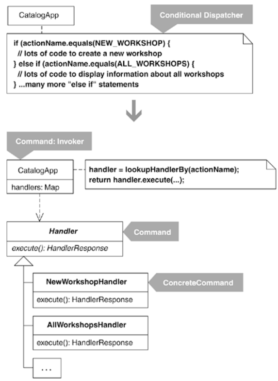

The example code we'll look at comes from a system I cowrote to create and organize Industrial Logic's HTML-based catalogs. Ironically, this system made heavy use of the Command pattern from its earliest evolutions. I decided to rewrite the sections of the system that used the Command pattern to not use the Command pattern in order to produce the kind of bloated, Command-thirsty code that I so frequently encounter in the field.

In the altered code, a class named CatalogApp is responsible for dispatching and executing actions and returning responses. It performs this work within one large conditional statement:

public class CatalogApp...
  private HandlerResponse executeActionAndGetResponse(String actionName, Map parameters)...
    if (actionName.equals(NEW_WORKSHOP)) {
      String nextWorkshopID = workshopManager.getNextWorkshopID();
      StringBuffer newWorkshopContents =
        workshopManager.createNewFileFromTemplate(
          nextWorkshopID,
          workshopManager.getWorkshopDir(),
          workshopManager.getWorkshopTemplate()
        );
      workshopManager.addWorkshop(newWorkshopContents);
      parameters.put("id",nextWorkshopID);
      executeActionAndGetResponse(ALL_WORKSHOPS, parameters);
    } else if (actionName.equals(ALL_WORKSHOPS)) {
      XMLBuilder allWorkshopsXml = new XMLBuilder("workshops");
      WorkshopRepository repository =
        workshopManager.getWorkshopRepository();
      Iterator ids = repository.keyIterator();
      while (ids.hasNext()) {
        String id = (String)ids.next();
        Workshop workshop = repository.getWorkshop(id);
        allWorkshopsXml.addBelowParent("workshop");
        allWorkshopsXml.addAttribute("id", workshop.getID());
        allWorkshopsXml.addAttribute("name", workshop.getName());
        allWorkshopsXml.addAttribute("status", workshop.getStatus());
        allWorkshopsXml.addAttribute("duration",
          workshop.getDurationAsString());
      }
      String formattedXml = getFormattedData(allWorkshopsXml.toString());
      return new HandlerResponse(
        new StringBuffer(formattedXml),
        ALL_WORKSHOPS_STYLESHEET
      );
    } ...many more "else if" statements

The complete conditional spans several pages—I'll spare you the details. The first leg of the conditional handles the creation of a new workshop. The second leg, which happens to be called by the first leg, returns XML that contains summary information for all of Industrial Logic's workshops. I'll show how to refactor this code to use the Command pattern.