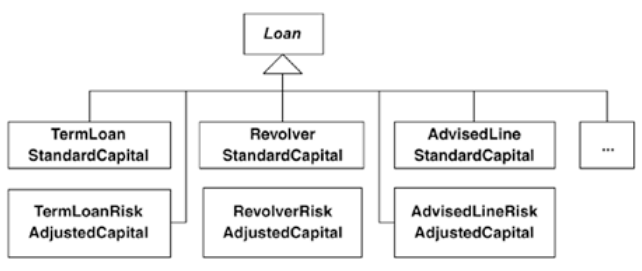

## project introduction
The example in the code sketch presented in the introduction to this refactoring deals with calculating capital for three different kinds of bank loans: a term loan, a revolver, and an advised line. It contains a fair amount of conditional logic used in performing the capital calculation, though it's less complicated and contains less conditional logic than was present in the original code, which handled capital calculations for seven distinct loan types.

In this example, we'll see how Loan's method for calculating capital can be strategized (i.e., delegated to a Strategy object). As you study the example, you may wonder why Loan wasn't simply subclassed to support the different styles of capital calculations. That would not have been a good design choice because the application that used Loan needed to accomplish the following.

Calculate capital for loans in a variety of ways. Had there been one Loan subclass for each type of capital calculation, the Loan hierarchy would have been overburdened with subclasses, as shown in the diagram on the following page.

Change a loan's capital calculation at runtime, without changing the class type of the Loan instance. This is easier to do when it involves exchanging a Loan object's Strategy instance for another Strategy instance, rather than changing the whole Loan object from one subclass of Loan into another.

Now let's look at some code. The Loan class, which plays the role of the context (as defined in the Mechanics section), contains a calculation method called capital():

public class Loan...
   public double capital() {
      if (expiry == null && maturity != null)
         return commitment * duration() * riskFactor();
      if (expiry != null && maturity == null) {
         if (getUnusedPercentage() != 1.0)
            return commitment * getUnusedPercentage() * duration() * riskFactor();
         else
            return (outstandingRiskAmount() * duration() * riskFactor())
                + (unusedRiskAmount() * duration() * unusedRiskFactor());
      }
      return 0.0;
   }

Much of the conditional logic deals with figuring out whether the loan is a term loan, a revolver, or an advised line. For example, a null expiry date and a non-null maturity date indicate a term loan. That code doesn't reveal its intentions well, does it? Once the code figures out what type of loan it has, a specific capital calculation can be performed. There are three such capital calculations, one for each loan type. All three of these calculations rely on the following helper methods:

public class Loan...
   private double outstandingRiskAmount() {
      return outstanding;
   }

   private double unusedRiskAmount() {
      return (commitment - outstanding);
   }

   public double duration() {
      if (expiry == null && maturity != null)
         return weightedAverageDuration();
      else if (expiry != null && maturity == null)
         return yearsTo(expiry);
      return 0.0;
   }

   private double weightedAverageDuration() {
      double duration = 0.0;
      double weightedAverage = 0.0;
      double sumOfPayments = 0.0;
      Iterator loanPayments = payments.iterator();
      while (loanPayments.hasNext()) {
         Payment payment = (Payment)loanPayments.next();
         sumOfPayments += payment.amount();
         weightedAverage += yearsTo(payment.date()) * payment.amount();
      }
      if (commitment != 0.0)
         duration = weightedAverage / sumOfPayments;
      return duration;
   }

   private double yearsTo(Date endDate) {
      Date beginDate = (today == null ? start : today);
      return ((endDate.getTime() - beginDate.getTime()) / MILLIS_PER_DAY) / DAYS_PER_YEAR;
   }

   private double riskFactor() {
      return RiskFactor.getFactors().forRating(riskRating);
   }

   private double unusedRiskFactor() {
      return UnusedRiskFactors.getFactors().forRating(riskRating);
   }

The Loan class can be simplified by extracting specific calculation logic into individual strategy classes, one for each loan type. For example, the method weightedAverageDuration() is used only to calculate capital for a term loan.

## step 1

Since the strategy I'd like to create will handle the calculation of a loan's capital, I create a class called CapitalStrategy.

public class CapitalStrategy {

}

## step 2
Now I apply Move Method [F] to move the capital() calculation to CapitalStrategy. This step involves leaving a simple version of capital() on Loan, which will delegate to an instance of CapitalStrategy.

The first step is to declare capital() in CapitalStrategy:

public class CapitalStrategy {
   
public double capital() {
     
return 0.0;
   
}
}

Now I need to copy code from Loan to CapitalStrategy. Of course, this will involve copying the capital() method. The mechanics for Move Method [F] encourage me to move whatever features (data or methods) are used solely by capital(). I begin by copying the capital() method and then see what else I can easily move from Loan to CapitalStrategy. I end up with the following code, which doesn't compile at the moment:

public class CapitalStrategy...
   
public double capital() {   // copied from Loan
      
if (expiry == null && maturity != null)
         
return commitment * duration() * riskFactor();
      
if (expiry != null && maturity == null) {
         
if (getUnusedPercentage() != 1.0)
            
return commitment * getUnusedPercentage() * duration() * riskFactor();
         
else
            
return (outstandingRiskAmount() * duration() * riskFactor())
                
+ (unusedRiskAmount() * duration() * unusedRiskFactor());
      
}
      
return 0.0;
   
}

   
private double riskFactor() {        // moved from Loan
      
return RiskFactor.getFactors().forRating(riskRating);
   
}

   
private double unusedRiskFactor() {    // moved from Loan
      
return UnusedRiskFactors.getFactors().forRating(riskRating);
   
}

I find that I cannot move the duration() method from Loan to CapitalStrategy because the weightedAverageDuration() method relies on Loan's payment information. Once I make that payment information accessible to CapitalStrategy, I'll be able to move duration() and its helper methods to CapitalStrategy. I'll do that soon. For now, I need to make the code I copied into CapitalStrategy compile. To do that, I must decide whether to pass a Loan reference as a parameter to capital() and its two helper methods or pass data as parameters to capital(), which it can use and pass to its helper methods. I determine that capital() needs the following information from a Loan instance:

Expiry date

Maturity date

Duration

Commitment amount

Risk rating

Unused percentage

Outstanding risk amount

Unused risk amount

If I can make that list smaller, I could go with a data-passing approach. So I speculate that I could create a LoanRange class to store dates associated with Loan instances (e.g., expiry and maturity dates). I might also be able to group the commitment amount, outstanding risk amount, and unused risk amount into a LoanRisk class or something with a better name.

Yet I quickly abandon these ideas when I realize that I have other methods to move from Loan to CapitalStrategy (such as duration()), which require that I pass even more information (such as payments) to CapitalStrategy. I decide to simply pass a Loan reference to CapitalStrategy and make the necessary changes on Loan to make all the code compile:

public class CapitalStrategy...
   public double capital(
Loan loan) {
      if (
loan.getExpiry() == null && 
loan.getMaturity() != null)
         return 
loan.getCommitment() * 
loan.duration() * 
riskFactorFor(loan);
      if (
loan.getExpiry() != null && 
loan.getMaturity() == null) {
         if (
loan.getUnusedPercentage() != 1.0)
            return 
loan.getCommitment() * 
loan.getUnusedPercentage()
            * 
loan.duration() * 
riskFactorFor(loan);
         else
            return
              (
loan.outstandingRiskAmount() * 
loan.duration() * 
riskFactorFor(loan))
            + (
loan.unusedRiskAmount() * 
loan.duration() * 
unusedRiskFactorFor(loan));
      }
      return 0.0;
   }

   private double riskFactor
For(Loan loan) {
      return RiskFactor.getFactors().forRating(
loan.getRiskRating());
   }

   private double unusedRiskFactor
For(Loan loan) {
      return UnusedRiskFactors.getFactors().forRating(
loan.getRiskRating());
   }

The changes I make to Loan all involve creating new methods that make Loan data accessible. Since CapitalStrategy lives in the same package as Loan, I can limit the visibility of this data by using Java's "package protection" feature. I do this by not assigning an explicit visibility (public, private, or protected) to each method:

public class Loan...
   
Date getExpiry() {
      
return expiry;
   
}

   
Date getMaturity() {
      
return maturity;
   
}

   
double getCommitment() {
      
return commitment;
   
}

   
double getUnusedPercentage() {
      
return unusedPercentage;
   
}

   

private double outstandingRiskAmount() {
      return outstanding;
   }

   

private double unusedRiskAmount() {
      return (commitment - outstanding);
   }

Now all the code in CapitalStrategy compiles. The next step in Move Method [F] is to make Loan delegate to CapitalStrategy for the capital calculation:

public class Loan...
   public double capital() {
      
return new CapitalStrategy().capital(this);
   }

Now everything compiles. I run my tests, such as the one below, to see that everything still works:

public class CapitalCalculationTests extends TestCase {
   public void testTermLoanSamePayments() {
      Date start = november(20, 2003);
      Date maturity = november(20, 2006);
      Loan termLoan = Loan.newTermLoan(LOAN_AMOUNT, start, maturity, HIGH_RISK_RATING);
      termLoan.payment(1000.00, november(20, 2004));
      termLoan.payment(1000.00, november(20, 2005));
      termLoan.payment(1000.00, november(20, 2006));
      assertEquals("duration", 2.0, termLoan.duration(), TWO_DIGIT_PRECISION);
      assertEquals("capital", 210.00, termLoan.capital(), TWO_DIGIT_PRECISION);
   }

All the tests pass. I can now focus on moving more functionality related to the capital calculation from Loan to CapitalStrategy. I will spare you the details; they are similar to what I've already shown. When I'm done, CapitalStrategy now looks like this:

public class CapitalStrategy {
   private static final int MILLIS_PER_DAY = 86400000;
   private static final int DAYS_PER_YEAR = 365;

   public double capital(Loan loan) {
      if (loan.getExpiry() == null && loan.getMaturity() != null)
         return loan.getCommitment() * loan.duration() * riskFactorFor(loan);
      if (loan.getExpiry() != null && loan.getMaturity() == null) {
         if (loan.getUnusedPercentage() != 1.0)
            return loan.getCommitment() * loan.getUnusedPercentage()
            * loan.duration() * riskFactorFor(loan);
         else
            return
              (loan.outstandingRiskAmount() * loan.duration() * riskFactorFor(loan))
            + (loan.unusedRiskAmount() * loan.duration() * unusedRiskFactorFor(loan));
      }
      return 0.0;
   }

   private double riskFactorFor(Loan loan) {
      return RiskFactor.getFactors().forRating(loan.getRiskRating());
   }

   private double unusedRiskFactorFor(Loan loan) {
      return UnusedRiskFactors.getFactors().forRating(loan.getRiskRating());
   }

   public double duration(Loan loan) {
      if (loan.getExpiry() == null && loan.getMaturity() != null)
         return weightedAverageDuration(loan);
      else if (loan.getExpiry() != null && loan.getMaturity() == null)
         return yearsTo(loan.getExpiry(), loan);
      return 0.0;
   }

   private double weightedAverageDuration(Loan loan) {
      double duration = 0.0;
      double weightedAverage = 0.0;
      double sumOfPayments = 0.0;
      Iterator loanPayments = loan.getPayments().iterator();
      while (loanPayments.hasNext()) {
         Payment payment = (Payment)loanPayments.next();
         sumOfPayments += payment.amount();
         weightedAverage += yearsTo(payment.date(), loan) * payment.amount();
      }
      if (loan.getCommitment() != 0.0)
         duration = weightedAverage / sumOfPayments;
      return duration;
   }

   private double yearsTo(Date endDate, Loan loan) {
      Date beginDate = (loan.getToday() == null ? loan.getStart() : loan.getToday());
      return ((endDate.getTime() - beginDate.getTime()) / MILLIS_PER_DAY) / DAYS_PER_YEAR;
   }
}

One consequence of performing these changes is that Loan's capital and duration calculations now look like this:

public class Loan...
   public double capital() {
      return new CapitalStrategy().capital(this);
   }

   public double duration() {
      return new CapitalStrategy().duration(this);
   }

While I resist the temptation to prematurely optimize the Loan class, I don't ignore an opportunity to remove duplication. In other words, it's time to replace the two occurrences of new CapitalStrategy() with a CapitalStrategy field on Loan:

public class Loan...
   
private CapitalStrategy capitalStrategy;

   private Loan(double commitment, double outstanding,
                 Date start, Date expiry, Date maturity, int riskRating) {
      
capitalStrategy = new CapitalStrategy();      ...
   }

   public double capital() {
      return 
capitalStrategy.capital(this);
   }

   public double duration() {
      return 
capitalStrategy.duration(this);
   }

I've now finished applying Move Method [F].

## step 3
Now I'll apply Extract Parameter (346) to make it possible to set the value of the delegate, which is currently hard-coded. This step will be important when we get to the next step in the refactoring:

public class Loan...
   private Loan(...,  
CapitalStrategy capitalStrategy) {
      ...
      this.capitalStrategy = capitalStrategy;
   }

   public static Loan newTermLoan(
      double commitment, Date start, Date maturity, int riskRating) {

      return new Loan(
         commitment, commitment, start, null,
         maturity, riskRating, 
new CapitalStrategy()
      );
   }

   public static Loan newRevolver(
      double commitment, Date start, Date expiry, int riskRating) {

      return new Loan(commitment, 0, start, expiry,
         null, riskRating, 
new CapitalStrategy()
      );
   }

   public static Loan newAdvisedLine(
      double commitment, Date start, Date expiry, int riskRating) {
      if (riskRating > 3) return null;
      Loan advisedLine =
         new Loan(commitment, 0, start, expiry, null, riskRating, 
new CapitalStrategy());
      advisedLine.setUnusedPercentage(0.1);
      return advisedLine;
   }
## step 4
I can now apply Replace Conditional with Polymorphism [F] on CapitalStrategy's capital() method. My first step is to create a subclass for the capital calculation for a term loan. This involves making some methods protected in CapitalStrategy (not shown below) and moving some methods to a new class called CapitalStrategyTermLoan (shown below):

public class CapitalStrategyTermLoan extends CapitalStrategy {
   
public double capital(Loan loan) {
      
return loan.getCommitment() * duration(loan) * riskFactorFor(loan);
   
}

   
public double duration(Loan loan) {
      
return weightedAverageDuration(loan);
   
}

   
private double weightedAverageDuration(Loan loan) {
      
double duration = 0.0;
      
double weightedAverage = 0.0;
      
double sumOfPayments = 0.0;
      
Iterator loanPayments = loan.getPayments().iterator();
      
while (loanPayments.hasNext()) {
         
Payment payment = (Payment)loanPayments.next();
         
sumOfPayments += payment.amount();
         
weightedAverage += yearsTo(payment.date(), loan) * payment.amount();
      
}
      
if (loan.getCommitment() != 0.0)
         
duration = weightedAverage / sumOfPayments;
      
return duration;
   
}

To test this class, I must first update Loan as follows:

public class Loan...
   public static Loan newTermLoan(
      double commitment, Date start, Date maturity, int riskRating) {
      return new Loan(
         commitment, commitment, start, null, maturity, riskRating,
         
new CapitalStrategyTermLoan()
      );
   }

The tests pass. Now I continue applying Replace Conditional with Polymorphism [F] to produce capital strategies for the other two loan types, revolver and advised line. Here are the changes I make to Loan:

public class Loan...
   public static Loan newRevolver(
      double commitment, Date start, Date expiry, int riskRating) {
      return new Loan(
         commitment, 0, start, expiry, null, riskRating,
         
new CapitalStrategyRevolver()
      );
   }

   public static Loan newAdvisedLine(
      double commitment, Date start, Date expiry, int riskRating) {
      if (riskRating > 3) return null;
      Loan advisedLine = new Loan(
          commitment, 0, start, expiry, null, riskRating,
          
new CapitalStrategyAdvisedLine()
      );
      advisedLine.setUnusedPercentage(0.1);
      return advisedLine;
   }

Here's a look at all of the new strategy classes:

You'll notice that CapitalStrategy is now an abstract class. It now looks like this:

public abstract class CapitalStrategy {
   private static final int MILLIS_PER_DAY = 86400000;
   private static final int DAYS_PER_YEAR = 365;

   public abstract double capital(Loan loan);

   protected double riskFactorFor(Loan loan) {
      return RiskFactor.getFactors().forRating(loan.getRiskRating());
   }

   public double duration(Loan loan) {
      return yearsTo(loan.getExpiry(), loan);
   }

   protected double yearsTo(Date endDate, Loan loan) {
      Date beginDate = (loan.getToday() == null ? loan.getStart() : loan.getToday());
      return ((endDate.getTime() - beginDate.getTime()) / MILLIS_PER_DAY) / DAYS_PER_YEAR;
   }
}

And that does it for this refactoring. Capital calculations, which include duration calculations, are now performed using several concrete strategies.

## step 1
he first step is to find an object selection method that relies on a criterion argument for its selection logic. The ProductFinder method byColor(Color colorOfProductToFind) meets this requirement:

public class ProductFinder...
   public List byColor(Color colorOfProductToFind) {
      List foundProducts = new ArrayList();
      Iterator products = repository.iterator();
      while (products.hasNext()) {
         Product product = (Product) products.next();
         if (product.getColor().equals(colorOfProductToFind))
            foundProducts.add(product);
      }
      return foundProducts;
   }

I create a concrete specification class for the criterion argument, Color colorOfProductToFind. I call this class ColorSpec. It needs to hold onto a Color field and provide a getter method for it:

public class ColorSpec {
   
private Color colorOfProductToFind;

   
public ColorSpec(Color colorOfProductToFind) {
      
this.colorOfProductToFind = colorOfProductToFind;
   
}

   
public Color getColorOfProductToFind() {
      
return colorOfProductToFind;
   
}

}

Now I can add a variable of type ColorSpec to the byColor(…) method and replace the reference to the parameter, colorOfProductToFind, with a reference to the specification's getter method:

public List byColor(Color colorOfProductToFind) {
   
ColorSpec spec = new ColorSpec(colorOfProductToFind);
   List foundProducts = new ArrayList();
   Iterator products = repository.iterator();
   while (products.hasNext()) {
      Product product = (Product) products.next();
      if (product.getColor().equals(
spec.getColorOfProductToFind()))
         foundProducts.add(product);
   }
   return foundProducts;
}

After these changes, I compile and run my tests. Here's one such test:

public void testFindByColor() {
   List foundProducts = finder.byColor(Color.red);
   assertEquals("found 2 red products", 2, foundProducts.size());
   assertTrue("found fireTruck", foundProducts.contains(fireTruck));
   assertTrue("found Toy Porsche Convertible", foundProducts.contains(toyConvertible));

}

## step 2
Now I'll apply Extract Method [F] to extract the conditional statement in the while loop to an isSatisfiedBy(…) method:

public List byColor(Color colorOfProductToFind) {
   ColorSpec spec = new ColorSpec(colorOfProductToFind);
   List foundProducts = new ArrayList();
   Iterator products = repository.iterator();
   while (products.hasNext()) {
      Product product = (Product) products.next();
      if (
isSatisfiedBy(spec, product))
         foundProducts.add(product);
   }
   return foundProducts;
}

private boolean isSatisfiedBy(ColorSpec spec, Product product) {
   
return product.getColor().equals(spec.getColorOfProductToFind());

}

The isSatisfiedBy(…) method can now be moved to ColorSpec by applying Move Method [F]:

public class ProductFinder...
   public List byColor(Color colorOfProductToFind) {
      ColorSpec spec = new ColorSpec(colorOfProductToFind);
      List foundProducts = new ArrayList();
      Iterator products = repository.iterator();
      while (products.hasNext()) {
         Product product = (Product) products.next();
         if (
spec.isSatisfiedBy(product))
            foundProducts.add(product);
      }
      return foundProducts;
   }

public class ColorSpec...
   
boolean isSatisfiedBy(Product product) {
      
return product.getColor().equals(getColorOfProductToFind());
   
}

Finally, I create a specification superclass by applying Extract Superclass [F] on ColorSpec:

public abstract class Spec {
   
public abstract boolean isSatisfiedBy(Product product);

}

I make ColorSpec extend this class:

public class ColorSpec 
extends Spec...

I compile and test to see that Product instances can still be selected by a given color correctly. Everything works fine.

## step 3
Now I repeat steps 1 and 2 for similar object selection methods. This includes methods that work with criteria (i.e., multiple pieces of criterion). For example, the byColorAndBelowPrice(…) method accepts two arguments that act as criteria for selecting Product instances out of the repository:

public List byColorAndBelowPrice(Color color, float price) {
   List foundProducts = new ArrayList();
   Iterator products = repository.iterator();
   while (products.hasNext()) {
      Product product = (Product)products.next();
      if (product.getPrice() < price && product.getColor() == color)
         foundProducts.add(product);
   }
   return foundProducts;
}

By implementing steps 1 and 2, I end up with the BelowPriceSpec class:

public class BelowPriceSpec extends Spec {
   
private float priceThreshold;

   
public BelowPriceSpec(float priceThreshold) {
      
this.priceThreshold = priceThreshold;
   
}
   
public boolean isSatisfiedBy(Product product) {
      
return product.getPrice() < getPriceThreshold();
   
}
   
public float getPriceThreshold() {
      
return priceThreshold;
   
}

}

Now I can create a new version of byColorAndBelowPrice(…) that works with the two concrete specifications:

public List byColorAndBelowPrice(Color color, float price) {
   
ColorSpec colorSpec = new ColorSpec(color);
   
BelowPriceSpec priceSpec = new BelowPriceSpec(price);
   List foundProducts = new ArrayList();
   Iterator products = repository.iterator();
   while (products.hasNext()) {
      Product product = (Product)products.next();
      if (
colorSpec.isSatisfiedBy(product) &&
         
priceSpec.isSatisfiedBy(product))
         foundProducts.add(product);
   }
   return foundProducts;
}

## step 4
The byColorAndBelowPrice(…) method uses criteria (color and price) in its object selection logic. I'd like to make this method, and others like it, work with a composite specification rather than with individual specifications. To do that, I'll implement a modified version of step 1 and an unmodified version of step 2. Here's how byColorAndBelowPrice(…) looks after step 1:

public List byColorAndBelowPrice(Color color, float price) {
   ColorSpec colorSpec = new ColorSpec(color);
   BelowPriceSpec priceSpec = new BelowPriceSpec(price);
   
AndSpec spec = new AndSpec(colorSpec, priceSpec);

   List foundProducts = new ArrayList();
   Iterator products = repository.iterator();
   while (products.hasNext()) {
      Product product = (Product)products.next();
      if (
spec.getAugend().isSatisfiedBy(product) &&
         
spec.getAddend().isSatisfiedBy(product))
         foundProducts.add(product);
   }
   return foundProducts;
}

The AndSpec class looks like this:

public class AndSpec {
   
private ProductSpecification augend, addend;

   
public AndSpec(Spec augend, Spec addend) {
      
this.augend = augend;
      
this.addend = addend;
   
}
   
public Spec getAddend() {
      
return addend;
   
}
   
public Spec getAugend() {
      
return augend;
   
}

}

After implementing step 2, the code now looks like this:

public List byColorAndBelowPrice(Color color, float price) {
   ...
   AndSpec spec = new AndSpec(colorSpec, priceSpec);

   while (products.hasNext()) {
      Product product = (Product)products.next();
      if (
spec.isSatisfiedBy(product))
         foundProducts.add(product);
   }
   return foundProducts;
}

public class AndSpec 
extends Spec...
   
public boolean isSatisfiedBy(Product product) {
      
return getAugend().isSatisfiedBy(product) &&
         
getAddend().isSatisfiedBy(product);
   
}

I now have a composite specification that handles an AND operation to join two concrete specifications. In another object selection method called belowPriceAvoidingAColor(…), I have more complicated conditional logic:

public class ProductFinder...
   public List belowPriceAvoidingAColor(float price, Color color) {
      List foundProducts = new ArrayList();
      Iterator products = repository.iterator();
      while (products.hasNext()) {
         Product product = (Product) products.next();
         if (product.getPrice() < price && product.getColor() != color)
            foundProducts.add(product);
      }
      return foundProducts;
   }

This code requires two composite specifications (AndProductSpecification and NotProductSpecification) and two concrete specifications. The conditional logic in the method can be portrayed as shown in the diagram on the following page.

My first task is to produce a NotSpec:

public class NotSpec extends Spec {
   
private Spec specToNegate;

   
public NotSpec(Spec specToNegate) {
      
this.specToNegate = specToNegate;
   
}
   
public boolean isSatisfiedBy(Product product) {
      
return !specToNegate.isSatisfiedBy(product);
   
}

}

Then I modify the conditional logic to use AndSpec and NotSpec:

public List belowPriceAvoidingAColor(float price, Color color) {
   
AndSpec spec =
      
new AndSpec(
         
new BelowPriceSpec(price),
         
new NotSpec(
            
new ColorSpec(color)
         
)
      
);

   List foundProducts = new ArrayList();
   Iterator products = repository.iterator();
   while (products.hasNext()) {
      Product product = (Product) products.next();
      if (
spec.isSatisfiedBy(product))
         foundProducts.add(product);
   }
   return foundProducts;
}

That takes care of the belowPriceAvoidingAColor(…) method. I continue replacing logic in the object selection methods until all of them use either one concrete specification or one composite specification.