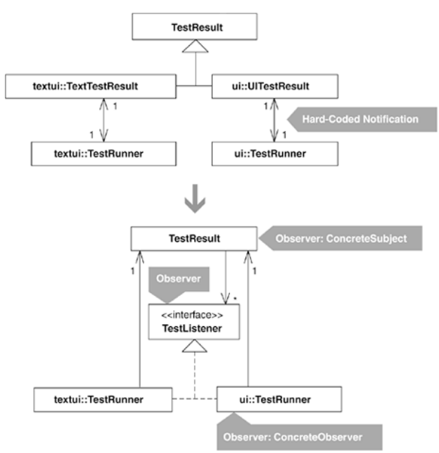

The code sketch at the beginning of this refactoring depicts a piece of the design of Kent Beck and Erich Gamma's JUnit Testing Framework [Beck and Gamma]. In JUnit 2.x, the authors defined two TestResult subclasses called UITestResult and TextTestResult, both of which are Collecting Parameters (see Move Accumulation to Collecting Parameter, 313).

TestResult subclasses gather information from test case objects (e.g., whether a test passed or failed) in order to report that information to a TestRunner, a class that displays test results to the screen. The UITestResult class was hard-coded to report information for a Java Abstract Window Toolkit (AWT) TestRunner, while the TextTestResult was hard-coded to report information for a console-based TestRunner. Here's a look at a part of the UITestResult class and the connection to its TestRunner:

class UITestResult extends TestResult {
   
private TestRunner fRunner;
   UITestResult(
TestRunner runner) {
      
fRunner= runner;
   }
   public synchronized void addFailure(Test test, Throwable t) {
      super.addFailure(test, t);
      
fRunner.addFailure(this, test, t);  // notification to TestRunner
   }
   ...
}

package ui;
public class TestRunner extends Frame {   
// TestRunner for AWT
   private TestResult fTestResult;
   ...
   protected TestResult createTestResult() {
      
return new UITestResult(this);   // hard-coded to UITestResult
   }
   synchronized public void runSuite() {
      ...
      
fTestResult = createTestResult();
      testSuite.run(
fTestResult);
   }
   public void addFailure(TestResult result, Test test, Throwable t) {
      ... 
// display the failure in a graphical AWT window
   }
}

This design was perfectly simple and good, for at this stage in JUnit's evolution, if the TestResult/TestRunner notifications had been programmed with the Observer pattern, the design would have been more sophisticated than it needed to be. That circumstance changed when users of JUnit requested the ability for multiple objects to observe a TestResult at runtime. Now the hard-coded relationship between TestRunner instances and TestResult instances wasn't sufficient. To make a TestResult instance capable of supporting many observers, an Observer implementation was necessary.

Would such a change be a refactoring or an enhancement? Making JUnit's TestRunner instances rely on an Observer implementation, rather than being hard-coded to specific TestResult subclasses, would not change their behavior; it would only make them more loosely coupled to TestResult. On the other hand, making a TestResult class hold onto a collection of observers, rather than just one solitary observer, would be new behavior. So an Observer implementation in this example is both a refactoring (i.e., a behavior-preserving transformation) and an enhancement. However, the refactoring is the essential work here, while the enhancement (supporting a collection of observers rather than just one observer) is simply a consequence of an introduction of the Observer pattern.

## step 1
The first step involves ensuring that every notifier implements only notification methods, instead of performing custom behavior on behalf of a receiver. This is true of UITestResult and not true of TextTestResult. Rather than notifying its TestRunner of test results, TextTestResult reports test results directly to the console using Java's System.out.println() method:

public class TextTestResult extends TestResult...
   public synchronized void addError(Test test, Throwable t) {
      super.addError(test, t);
      
System.out.println("E");
   }
   public synchronized void addFailure(Test test, Throwable t) {
      super.addFailure(test, t);
      
System.out.print("F");
   }

By applying Move Method [F], I make TextTestResult contain pure notification methods, while moving its custom behavior to its associated TestRunner:

package textui;
public class TextTestResult extends TestResult...
   
private TestRunner fRunner;
   TextTestResult(
TestRunner runner) {
      
fRunner= runner;
   }

   public synchronized void addError(Test test, Throwable t) {
      super.addError(test, t);
      
fRunner.addError(this, test, t);
   }

   ...

package textui;
public class TestRunner...
   protected TextTestResult createTestResult() {
      return new TextTestResult(
this);
   }

   
// moved method
   
public void addError(TestResult testResult, Test test, Throwable t) {
      
System.out.println("E");
   
}

   ...

TextTestResult now notifies its TestRunner, which reports information to the screen. I compile and test to confirm that the changes work.

