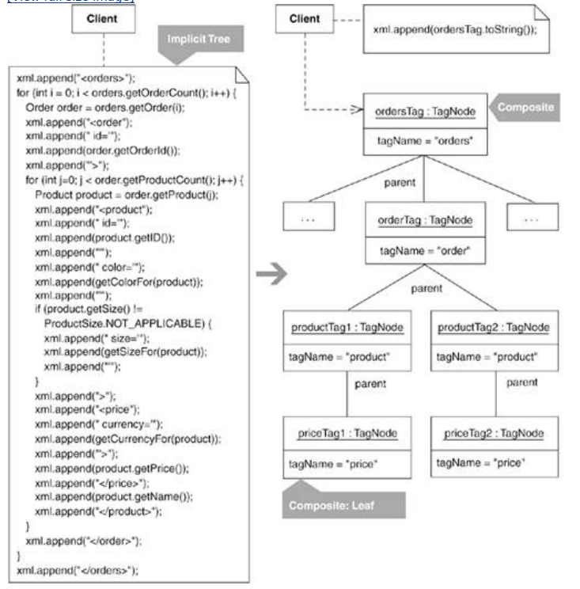
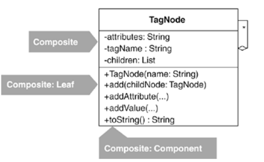

## init project
The code that produces the implicit tree in the code sketch at the beginning of this refactoring section comes from a shopping system. In that system, there is an OrdersWriter class, which has a getContents() method. Before proceeding with the refactoring, I first break the large getContents() method into smaller methods by applying Compose Method (123) and Move Accumulation to Collecting Parameter (313):

public class OrdersWriter {
  private Orders orders;

  public OrdersWriter(Orders orders) {
    this.orders = orders;
  }

  public String getContents() {
    StringBuffer xml = new StringBuffer();
    
writeOrderTo(xml);
    return xml.toString();
  }

  
private void writeOrderTo(StringBuffer xml) {
    
xml.append("<orders>");
    
for (int i = 0; i < orders.getOrderCount(); i++) {
      
Order order = orders.getOrder(i);
      
xml.append("<order");
      
xml.append(" id='");
      
xml.append(order.getOrderId());
      
xml.append("'>");
      
writeProductsTo(xml, order);
      
xml.append("</order>");
    
}
    
xml.append("</orders>");
  
}

  
private void writeProductsTo(StringBuffer xml, Order order) {
    
for (int j=0; j < order.getProductCount(); j++) {
      
Product product = order.getProduct(j);
      
xml.append("<product");
      
xml.append(" id='");
      
xml.append(product.getID());
      
xml.append("'");
      
xml.append(" color='");
      
xml.append(colorFor(product));
      
xml.append("'");
      
if (product.getSize() != ProductSize.NOT_APPLICABLE) {
        
xml.append(" size='");
        
xml.append(sizeFor(product));
        
xml.append("'");
      
}
      
xml.append(">");
      
writePriceTo(xml, product);
      
xml.append(product.getName());
      
xml.append("</product>");
    
}
  
}

  
private void writePriceTo(StringBuffer xml, Product product) {
    
xml.append("<price");
    
xml.append(" currency='");
    
xml.append(currencyFor(product));
    
xml.append("'>");
    
xml.append(product.getPrice());
    
xml.append("</price>");
  
}

Now that getContents() has been refactored, it's easier to see additional refactoring possibilities. One reader of this code noticed that the methods writeOrderTo(…), writeProductsTo(…), and writePriceTo(…) all loop through the domain objects Order, Product, and Price in order to extract data from them for use in producing XML. This reader wondered why the code doesn't just ask the domain objects for their XML directly, rather than having to build it externally to the domain objects. In other words, if the Order class had a toXML() method and the Product and Price classes had one as well, obtaining XML for an Order would simply involve making one call to an Order's toXML() method. That call would obtain the XML from the Order, as well as the XML from whatever Product instances were part of the Order and whatever Price was associated with each Product. This approach would take advantage of the existing structure of the domain objects, rather than recreating that structure in methods like writeOrderTo(…), writeProductsTo(…), and writePriceTo(…).

As nice as this idea sounds, it isn't a good design when a system must create many XML representations of the same domain objects. For example, the code we've been looking at comes from a shopping system that requires diverse XML representations for the domain objects:

   <order id='987' totalPrice='14.00'>
     <product id='f1234' price='9.00' quantity='1'>
       Fire Truck
     </product>
     <product id='f4321' price='5.00' quantity='1'>
       Rubber Ball
     </product>
   </order>

   <orderHistory>
     <order date='20041120' totalPrice='14.00'>
       <product id='f1234'>
       <product id='f4321'>
     </order>
   </orderHistory>

   <order id='321'>
     <product id='f1234' color='red' size='medium'>
       <price currency='USD'>
         8.95
       </price>
       Fire Truck
     </product>
   </order>

Producing the above XML would be difficult and awkward using a single toXML() method on each domain object because the XML is so different in each case. Given such a situation, you can either choose to do the XML rendering external to the domain objects (as the writeOrderTo(…), writeProductsTo(…), and writePriceTo(…) methods do), or you can pursue a Visitor solution (see Move Accumulation to Visitor, 320).

For this shopping system, which generates a lot of diverse XML for the same domain objects, refactoring to Visitor makes a lot of sense. However, at the moment, the creation of the XML is still not simple; you have to get the formatting just right and remember to close every tag. I want to simplify this XML generation prior to refactoring to Visitor. Because the Composite pattern can help simplify the XML generation, I proceed with this refactoring.

## step1
To identify an implicit leaf, I study fragments of test code, such as this one:

String expectedResult =
"<orders>" +
  "<order id='321'>" +
    "<product id='f1234' color='red' size='medium'>" +
      "<price currency='USD'>" +
        "8.95" +
      "</price>" +
      "Fire Truck" +
    "</product>" +
  "</order>" +
"</orders>";

Here, I face a decision: Which should I treat as an implicit leaf, the <price>…</price> tag or its value, 8.95? I choose the <price>…</price> tag because I know that the leaf node class I'll create to correspond with the implicit leaf can easily represent the tag's value, 8.95.

Another observation I make is that every XML tag in the implicit tree has a name, an optional number of attributes (name/value pairs), optional children, and an optional value. I ignore the optional children part for the moment (we'll get to that in step 4). This means that I can produce one general leaf node to represent all implicit leaves in the implicit tree. I produce this class, which I call TagNode, using test-driven development. Here's a test I write after already writing and passing some simpler tests:

public class TagTests extends TestCase...
  
private static final String SAMPLE_PRICE = "8.95";
  
public void testSimpleTagWithOneAttributeAndValue() {
    
TagNode priceTag = new TagNode("price");
    
priceTag.addAttribute("currency", "USD");
    
priceTag.addValue(SAMPLE_PRICE);
    
String expected =
      
"<price currency=" +
      
"'" +
      
"USD" +
      
"'>" +
      
SAMPLE_PRICE +
      
"</price>";
    
assertEquals("price XML", expected, priceTag.toString());
  
}

Here's the code to make the test pass:

public class TagNode {
  
private String name = "";
  
private String value = "";
  
private StringBuffer attributes;

  
public TagNode(String name) {
    
this.name = name;
    
attributes = new StringBuffer("");
  
}

  
public void addAttribute(String attribute, String value) {
    
attributes.append(" ");
    
attributes.append(attribute);
    
attributes.append("='");
    
attributes.append(value);
    
attributes.append("'");
  
}

  
public void addValue(String value) {
    
this.value = value;
  
}

  
public String toString() {
    
String result;
    
result =
      
"<" + name + attributes + ">" +
      
value +
      
"</" + name + ">";
    
return result;
  
}

## step2
I can now replace the implicit leaf in the getContents() method with a TagNode instance:

public class OrdersWriter...
  private void writePriceTo(StringBuffer xml, Product product) {
    
TagNode priceNode = new TagNode("price");
    
priceNode.addAttribute("currency", currencyFor(product));
    
priceNode.addValue(priceFor(product));
    
xml.append(priceNode.toString());
    

xml.append(" currency='");    

xml.append("<price");
    

xml.append(currencyFor(product));
    

xml.append("'>");
    

xml.append(product.getPrice());
    

xml.append("</price>");
  }

I compile and run tests to ensure that the implicit tree is still rendered correctly.

## step3-4
3.Because TagNode models all of the implicit leaves in the XML, I do not need to repeat steps 1 and 2 to convert additional implicit leaves to leaf nodes, nor do I need to ensure that all newly created leaf nodes share a common interface—they already do.

4.Now I identify an implicit parent by studying fragments of test code. I find that a <product> tag is a parent for a <price> tag, an <order> tag is a parent for a <product> tag, and an <orders> tag is a parent for an <order> tag. Yet because each of these implicit parents is already so similar in nature to the implicit leaf identified earlier, I see that I can produce a parent node by adding child-handling support to TagNode. I follow test-driven development to produce this new code. Here's the first test I write:

public void testCompositeTagOneChild() {
  
TagNode productTag = new TagNode("product");
  
productTag.add(new TagNode("price"));
  
String expected =
    
"<product>" +
      
"<price>" +
      
"</price>" +
    
"</product>";
  
assertEquals("price XML", expected, productTag.toString());

}

And here's code to pass that test:

public class TagNode...
  
private List children;

  public String toString() {
    String result;
    result = "<" + name + attributes + ">";
    
Iterator it = children().iterator();
    
while (it.hasNext()) {
      
TagNode node = (TagNode)it.next();
      
result += node.toString();
    
}
    result += value;
    result += "</" + name + ">";
    return result;
  }

  
private List children() {
    
if (children == null)
      
children = new ArrayList();
    
return children;
  
}

  
public void add(TagNode child) {
    
children().add(child);
  
}

Here's a slightly more robust test:

public void testAddingChildrenAndGrandchildren() {
   
String expected =
   
"<orders>" +
     
"<order>" +
        
"<product>" +
        
"</product>" +
     
"</order>" +
   
"</orders>";
   
TagNode ordersTag = new TagNode("orders");
   
TagNode orderTag = new TagNode("order");
   
TagNode productTag = new TagNode("product");
   
ordersTag.add(orderTag);
   
orderTag.add(productTag);
   
assertEquals("price XML", expected, ordersTag.toString());

}

I continue writing and running tests until I'm satisfied that TagNode can behave as a proper parent node. When I'm done, TagNode is a class that can play all three participants in the Composite pattern:

## step5
Now I replace every occurrence of the implicit parent with code that uses a parent node instance, outfitted with the correct leaf node instance(s). Here's an example:

public class OrdersWriter...
  private void writeProductsTo(StringBuffer xml, Order order) {
    for (int j=0; j < order.getProductCount(); j++) {
      Product product = order.getProduct(j);
      
TagNode productTag = new TagNode("product");
      
productTag.addAttribute("id", product.getID());
      
productTag.addAttribute("color", colorFor(product));
      if (product.getSize() != ProductSize.NOT_APPLICABLE)
        
productTag.addAttribute("size", sizeFor(product));
      
writePriceTo(productTag, product);
      
productTag.addValue(product.getName());
      xml.append(
productTag.toString());
    }
  }

  
private void writePriceTo(TagNode productTag, Product product) {
    TagNode priceTag = new TagNode("price");
    priceTag.addAttribute("currency", currencyFor(product));
    priceTag.addValue(priceFor(product));
    
productTag.add(priceTag);
  }

I compile and run tests to ensure that the implicit tree still renders itself correctly.

## step6
 I repeat steps 4 and 5 for all remaining implicit parents. This yields the following code, which is identical to the after code in the code sketch on the first page of this refactoring, except that the code is broken up into smaller methods:

public class OrdersWriter...
  public String getContents() {
    StringBuffer xml = new StringBuffer();
    writeOrderTo(xml);
    return xml.toString();
  }

  private void writeOrderTo(StringBuffer xml) {
    TagNode ordersTag = new TagNode("orders");
    for (int i = 0; i < orders.getOrderCount(); i++) {
      Order order = orders.getOrder(i);
      TagNode orderTag = new TagNode("order");
      orderTag.addAttribute("id", order.getOrderId());
      writeProductsTo(orderTag, order);
      ordersTag.add(orderTag);
    }
    xml.append(ordersTag.toString());
  }

  private void writeProductsTo(TagNode orderTag, Order order) {
    for (int j=0; j < order.getProductCount(); j++) {
      Product product = order.getProduct(j);
      TagNode productTag = new TagNode("product");
      productTag.addAttribute("id", product.getID());
      productTag.addAttribute("color", colorFor(product));
      if (product.getSize() != ProductSize.NOT_APPLICABLE)
        productTag.addAttribute("size", sizeFor(product));
      writePriceTo(productTag, product);
      productTag.addValue(product.getName());
      orderTag.add(productTag);
    }
  }

  private void writePriceTo(TagNode productTag, Product product) {
    TagNode priceNode = new TagNode("price");
    priceNode.addAttribute("currency", currencyFor(product));
    priceNode.addValue(priceFor(product));
    productTag.add(priceNode);
  }