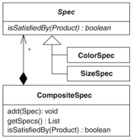

This example deals with Spec instances and how they are used to obtain a desired set of Product instances from a ProductRepository. The example also illustrates the Specification pattern [Evans] as described in Replace Implicit Language with Interpreter (269).

Let's begin by studying some test code for the ProductRepository. Before any test can run, a ProductRepository (called repository) must be created. For the test code, I fill a repository with toy Product instances:

public class ProductRepositoryTest extends TestCase...
   private ProductRepository repository;

   private Product fireTruck =
      new Product("f1234", "Fire Truck",
         Color.red, 8.95f, ProductSize.MEDIUM);

   private Product barbieClassic =
      new Product("b7654", "Barbie Classic",
         Color.yellow, 15.95f, ProductSize.SMALL);

   private Product frisbee =
      new Product("f4321", "Frisbee",
         Color.pink, 9.99f, ProductSize.LARGE);

   private Product baseball =
      new Product("b2343", "Baseball",
         Color.white, 8.95f, ProductSize.NOT_APPLICABLE);

   private Product toyConvertible =
      new Product("p1112", "Toy Porsche Convertible",
         Color.red, 230.00f, ProductSize.NOT_APPLICABLE);

   protected void setUp() {
      repository = new ProductRepository();
      repository.add(fireTruck);
      repository.add(barbieClassic);
      repository.add(frisbee);
      repository.add(baseball);
      repository.add(toyConvertible);
   }

The first test we'll study looks for Product instances of a certain color by means of a call to repository.selectBy(…):

public class ProductRepositoryTest extends TestCase...
   public void testFindByColor() {
      List foundProducts = repository.selectBy(new ColorSpec(Color.red));
      assertEquals("found 2 red products", 2, foundProducts.size());
      assertTrue("found fireTruck", foundProducts.contains(fireTruck));
      assertTrue(
         "found Toy Porsche Convertible",
         foundProducts.contains(toyConvertible));
   }

The repository.selectBy(…) method looks like this:

public class ProductRepository...
   private List products = new ArrayList();

   public Iterator iterator() {
      return products.iterator();
   }

   public List selectBy(Spec spec) {
      List foundProducts = new ArrayList();
      Iterator products = iterator();
      while (products.hasNext()) {
         Product product = (Product)products.next();
         if (spec.isSatisfiedBy(product))
            foundProducts.add(product);
      }
      return foundProducts;
   }

Let's now look at another test, which calls a different repository.selectBy(…) method. This test assembles a List of Spec instances in order to select specific kinds of products from the repository:

public class ProductRepositoryTest extends TestCase...
   public void testFindByColorSizeAndBelowPrice() {
      List specs = new ArrayList();
      specs.add(new ColorSpec(Color.red));
      specs.add(new SizeSpec(ProductSize.SMALL));
      specs.add(new BelowPriceSpec(10.00));
      List foundProducts = repository.selectBy(specs);
      assertEquals(
         "small red products below $10.00",
         0,
         foundProducts.size());
   }

The List-based repository.selectBy(…) method looks like this:

public class ProductRepository {
   public List selectBy(List specs) {
      List foundProducts = new ArrayList();
      Iterator products = iterator();
      while (products.hasNext()) {
         Product product = (Product)products.next();
         Iterator specifications = specs.iterator();
         boolean satisfiesAllSpecs = true;
         while (specifications.hasNext()) {
            Spec productSpec = ((Spec)specifications.next());
            satisfiesAllSpecs &= productSpec.isSatisfiedBy(product);
         }
         if (satisfiesAllSpecs)
            foundProducts.add(product);
      }
      return foundProducts;
   }

As you can see, the List-based selectBy(…) method is more complicated than the one-Spec selectBy(…) method. If you compare the two methods, you'll notice a good deal of duplicate code. A Composite can help remove this duplication; however, there's another way to remove the duplication that doesn't involve a Composite. Consider this:

public class ProductRepository...
   public List selectBy(Spec spec) {
      
Spec[] specs = { spec };
      
return selectBy(Arrays.asList(specs));
   }

   public List selectBy(List specs)...
      
// same implementation as before

This solution retains the more complicated List-based selectBy(…) method. However, it also completely simplifies the one-Spec selectBy(…) method, which greatly reduces the duplicated code. The only remaining duplication is the existence of the two selectBy(…) methods.

So, is it wise to use this solution instead of refactoring to Composite? Yes and no. It all depends on the needs of the code in question. For the system on which this example code was based, there is a need to support queries with OR, AND, and NOT conditions, like this one:

product.getColor() != targetColor ||
product.getPrice() < targetPrice

The List-based selectBy(…) method cannot support such queries. In addition, having just one selectBy(…) method is preferred so clients can call it in a uniform way. Therefore, I decide to refactor to the Composite pattern by implementing the following steps.

## step1
The List-based selectBy(…) method is the many-object method. It accepts the following parameter: List specs. My first step is to create a new class that will hold onto the value of the specs parameter and provide access to it via a getter method:

public class CompositeSpec {
   
private List specs;

   
public CompositeSpec(List specs) {
      
this.specs = specs;
   
}

   
public List getSpecs() {
      
return specs;
   
}

}

Next, I'll instantiate this class within the List-based selectBy(…) method and update code to call its getter method:

public class ProductRepository...
   public List selectBy(List specs) {
      
CompositeSpec spec = new CompositeSpec(specs);
      List foundProducts = new ArrayList();
      Iterator products = iterator();
      while (products.hasNext()) {
         Product product = (Product)products.next();
         Iterator specifications = 
spec.getSpecs().iterator();
         boolean satisfiesAllSpecs = true;
         while (specifications.hasNext()) {
            Spec productSpec = ((Spec)specifications.next());
            satisfiesAllSpecs &= productSpec.isSatisfiedBy(product);
         }
         if (satisfiesAllSpecs)
            foundProducts.add(product);
      }
      return foundProducts;
   }

I compile and test to confirm that these changes work.

## step2
Now I apply Extract Method [F] on the selectBy(…) code that specifically deals with specs:

public class ProductRepository...
   public List selectBy(List specs) {
      CompositeSpec spec = new CompositeSpec(specs);
      List foundProducts = new ArrayList();
      Iterator products = iterator();
      while (products.hasNext()) {
         Product product = (Product)products.next();
         if (
isSatisfiedBy(spec, product))
            foundProducts.add(product);
      }
      return foundProducts;
   }

   
public boolean isSatisfiedBy(CompositeSpec spec, Product product) {
      
Iterator specifications = spec.getSpecs().iterator();
      
boolean satisfiesAllSpecs = true;
      
while (specifications.hasNext()) {
         
Spec productSpec = ((Spec)specifications.next());
         
satisfiesAllSpecs &= productSpec.isSatisfiedBy(product);
      
}
      
return satisfiesAllSpecs;
   
}

The compiler and test code are happy with this change, so I can now apply Move Method [F] to move the isSatisfiedBy(…) method to the CompositeSpec class:

public class ProductRepository...
   public List selectBy(List specs) {
      CompositeSpec spec = new CompositeSpec(specs);
      List foundProducts = new ArrayList();
      Iterator products = iterator();
      while (products.hasNext()) {
         Product product = (Product)products.next();
         if (
spec.isSatisfiedBy(product))
            foundProducts.add(product);
      }
      return foundProducts;
   }

public class CompositeSpec...
   
public boolean isSatisfiedBy(Product product) {
      
Iterator specifications = getSpecs().iterator();
      
boolean satisfiesAllSpecs = true;
      
while (specifications.hasNext()) {
         
Spec productSpec = ((Spec)specifications.next());
         
satisfiesAllSpecs &= productSpec.isSatisfiedBy(product);
      
}
      
return satisfiesAllSpecs;
   
}

One again, I check that the compiler and test code are happy with this change. Both are.

## step3-4
The two selectBy(…) methods are now nearly identical. The only difference is that the List-based selectBy(…) method instantiates a CompositeSpec instance:

public class ProductRepository...
   public List selectBy(Spec spec) {
      // same code
   }

   public List selectBy(List specs) {
      
CompositeSpec spec = new CompositeSpec(specs);
      // same code
   }

The next step will help remove the duplicated code.

4. I now want to make the List-based selectBy(…) method call the one-Spec selectBy(…) method, like so:

public class ProductRepository...
   public List selectBy(Spec spec)...

   public List selectBy(List specs) {
      
return selectBy(new CompositeSpec(specs));
   }

The compiler does not like this code because CompositeSpec does not share the same interface as Spec, the type used by the called selectBy(…) method. Spec is an abstract class that looks like this:

Since CompositeSpec already implements the isSatisfiedBy(…) method declared by Spec, it's trivial to make CompositeSpec a subclass of Spec:

public class CompositeSpec 
extends Spec...

Now the compiler is happy, as is the test code.

## step5-6
Because the List-based selectBy(…) method is now only one line of code that calls the one-Spec selectBy(…) method, I inline it by applying Inline Method [F]. Client code that used to call the List-based selectBy(…) now calls the one-Spec selectBy(…) method. Here's an example of such a change:

public class ProductRepositoryTest...
   public void testFindByColorSizeAndBelowPrice() {
      List specs = new ArrayList();
      specs.add(new ColorSpec(Color.red));
      specs.add(new SizeSpec(ProductSize.SMALL));
      specs.add(new BelowPriceSpec(10.00));
      

List foundProducts = repository.selectBy(specs);
      List foundProducts = repository.selectBy(
new CompositeSpec(specs));
      ...

There's now only one selectBy(…) method that accepts Spec objects like ColorSpec, SizeSpec, or the new CompositeSpec. This is a useful start. However, to build Composite structures that support product searches like product.getColor() != targetColor || product.getPrice() < targetPrice, there is a need for classes like NotSpec and OrSpec. I won't show how they're created here; you can read about them in the refactoring Replace Implicit Language with Interpreter (269).

6. The final step involves applying Encapsulate Collection [F] on the collection inside of CompositeSpec. I do this to make CompositeSpec more type-safe (i.e., to prevent clients from adding objects to it that aren't a subclass of Spec).

I begin by defining the add(Spec spec) method:

public class CompositeSpec extends Spec...
   private List specs;

   
public void add(Spec spec) {
      
specs.add(spec);
   
}

Next, I initialize specs to an empty list:

public class CompositeSpec extends Spec...
   private List specs 
= new ArrayList();

Now comes the fun part. I find all callers of CompositeSpec's constructor and update them to call a new, default CompositeSpec constructor as well as the new add(…) method. Here is one such caller and the updates I make to it:

public class ProductRepositoryTest...
   public void testFindByColorSizeAndBelowPrice()...
      

List specs = new ArrayList();
      
CompositeSpec specs = new CompositeSpec();
      specs.add(new ColorSpec(Color.red));
      specs.add(new SizeSpec(ProductSize.SMALL));
      specs.add(new BelowPriceSpec(10.00));
      List foundProducts = repository.selectBy(
specs);
      ...

I compile and test to confirm that the changes work. Once I've updated all other clients, there are no more callers to CompositeSpec's constructor that take a List. So I delete it:

public class CompositeSpec extends Spec...
   

public CompositeSpec(List specs) {
      

this.specs = specs;
   

}

Now I update CompositeSpec's getSpecs(…) method to return an unmodifiable version of specs:

public class CompositeSpec extends Spec...
   private List specs = new ArrayList();

   public List getSpecs()
      return 
Collections.unmodifiableList(specs);
   }

I compile and test to confirm that my implementation of Encapsulate Collection works. It does. CompositeSpec is now a fine implementation of the Composite pattern:
