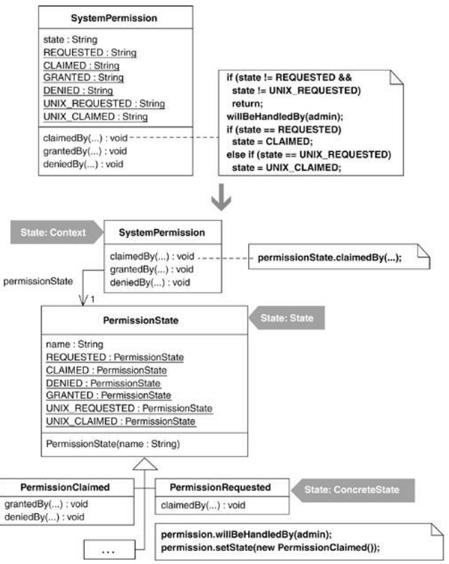

To understand when it makes sense to refactor to the State pattern, it helps to study a class that manages its state without requiring the sophistication of the State pattern. SystemPermission is such a class. It uses simple conditional logic to keep track of the state of a permission request to access a software system. Over the lifetime of a SystemPermission object, an instance variable named state transitions between the states requested, claimed, denied, and granted. Here is a state diagram of the possible transitions:

Below is the code for SystemPermission and a fragment of test code to show how the class gets used:

public class SystemPermission...
  private SystemProfile profile;
  private SystemUser requestor;
  private SystemAdmin admin;
  private boolean isGranted;
  private String state;

  public final static String REQUESTED = "REQUESTED";
  public final static String CLAIMED = "CLAIMED";
  public final static String GRANTED = "GRANTED";
  public final static String DENIED = "DENIED";

  public SystemPermission(SystemUser requestor, SystemProfile profile) {
    this.requestor = requestor;
    this.profile = profile;
    state = REQUESTED;
    isGranted = false;
    notifyAdminOfPermissionRequest();
  }

  public void claimedBy(SystemAdmin admin) {
    if (!state.equals(REQUESTED))
      return;
    willBeHandledBy(admin);
    state = CLAIMED;
  }

  public void deniedBy(SystemAdmin admin) {
    if (!state.equals(CLAIMED))
      return;
    if (!this.admin.equals(admin))
      return;
    isGranted = false;
    state = DENIED;
    notifyUserOfPermissionRequestResult();
  }

  public void grantedBy(SystemAdmin admin) {
    if (!state.equals(CLAIMED))
      return;
    if (!this.admin.equals(admin))
      return;
    state = GRANTED;
    isGranted = true;
    notifyUserOfPermissionRequestResult();
  }

public class TestStates extends TestCase...
  private SystemPermission permission;

  public void setUp() {
    permission = new SystemPermission(user, profile);
  }

  public void testGrantedBy() {
    permission.grantedBy(admin);
    assertEquals("requested", permission.REQUESTED, permission.state());
    assertEquals("not granted", false, permission.isGranted());
    permission.claimedBy(admin);
    permission.grantedBy(admin);
    assertEquals("granted", permission.GRANTED, permission.state());
    assertEquals("granted", true, permission.isGranted());
  }

Notice how the instance variable, state, gets assigned to different values as clients call specific SystemPermission methods. Now look at the overall conditional logic in SystemPermission. This logic is responsible for transitioning between states, but the logic isn't very complicated so the code doesn't require the sophistication of the State pattern.

This conditional state-changing logic can quickly become hard to follow as more real-world behavior gets added to the SystemPermission class. For example, I helped design a security system in which users needed to obtain UNIX and/or database permissions before the user could be granted general permission to access a given software system. The state transition logic that requires UNIX permission before general permission may be granted looks like this:

Adding support for UNIX permission makes SystemPermission's state-altering conditional logic more complicated than it used to be. Consider the following:

public class SystemPermission...
  public void claimedBy(SystemAdmin admin) {
    if (!state.equals(REQUESTED) && !state.equals(UNIX_REQUESTED))
      return;
    willBeHandledBy(admin);
    if (state.equals(REQUESTED))
      state = CLAIMED;
    else if (state.equals(UNIX_REQUESTED))
      state = UNIX_CLAIMED;
  }

  public void deniedBy(SystemAdmin admin) {
    if (!state.equals(CLAIMED) && !state.equals(UNIX_CLAIMED))
      return;
    if (!this.admin.equals(admin))
      return;
    isGranted = false;
    isUnixPermissionGranted = false;
    state = DENIED;
    notifyUserOfPermissionRequestResult();
  }

  public void grantedBy(SystemAdmin admin) {
    if (!state.equals(CLAIMED) && !state.equals(UNIX_CLAIMED))
      return;
    if (!this.admin.equals(admin))
      return;

    if (profile.isUnixPermissionRequired() && state.equals(UNIX_CLAIMED))
      isUnixPermissionGranted = true;
    else if (profile.isUnixPermissionRequired() &&
      !isUnixPermissionGranted()) {
      state = UNIX_REQUESTED;
      notifyUnixAdminsOfPermissionRequest();
      return;
    }
    state = GRANTED;
    isGranted = true;
    notifyUserOfPermissionRequestResult();
  }

An attempt can be made to simplify this code by applying Extract Method [F]. For example, I could refactor the grantedBy() method like so:

public void grantedBy(SystemAdmin admin) {
  if (
!isInClaimedState())
    return;
  if (!this.admin.equals(admin))
    return;
  if (
isUnixPermissionRequestedAndClaimed())
    isUnixPermissionGranted = true;
  else if (
isUnixPermisionDesiredButNotRequested()) {
    state = UNIX_REQUESTED;
    notifyUnixAdminsOfPermissionRequest();
    return;
  }
  ...

Although that's an improvement, SystemPermission now has lots of state-specific Boolean logic (e.g., methods like isUnixPermissionRequestedAndClaimed()), and the grantedBy() method still isn't simple. It's time to see how I simplify things by refactoring to the State pattern.

## step1
SystemPermission has a field called state, which is of type String. The first step is to change state's type to be a class by applying the refactoring Replace Type Code with Class (286). This yields the following new class:

public class PermissionState {
  
private String name;

  
private PermissionState(String name) {
    
this.name = name;
  
}

  
public final static PermissionState REQUESTED = new PermissionState("REQUESTED");
  
public final static PermissionState CLAIMED = new PermissionState("CLAIMED");
  
public final static PermissionState GRANTED = new PermissionState("GRANTED");
  
public final static PermissionState DENIED = new PermissionState("DENIED");
  
public final static PermissionState UNIX_REQUESTED =
    
new PermissionState("UNIX_REQUESTED");
  
public final static PermissionState UNIX_CLAIMED = new PermissionState("UNIX_CLAIMED");

  
public String toString() {
    
return name;
  
}

}

The refactoring also replaces SystemPermission's state field with one called permissionState, which is of type PermissionState:

public class SystemPermission...
  
private PermissionState permissionState;

  public SystemPermission(SystemUser requestor, SystemProfile profile) {
    ...
    
setPermission(PermissionState.REQUESTED);
    ...
  }

  public 
PermissionState getState() {
    return 
permissionState;
  }

  
private void setState(PermissionState state) {
    
permissionState = state;
  
}

  public void claimedBy(SystemAdmin admin) {
    
if (!getState().equals(PermissionState.REQUESTED)
     
&& !getState().equals(PermissionState.UNIX_REQUESTED))
       
return;
    
...
  }

  etc...

## step2
PermissionState now contains six constants, all of which are instances of PermissionState. To make each of these constants an instance of a subclass of PermissionState, I apply Extract Subclass [F] six times to produce the result shown in the following diagram.

Because no client will ever need to instantiate PermissionState, I declare it to be abstract:

public 
abstract class PermissionState...

The compiler is happy with all of the new code, so I press on.

## step3
Next, I find a method on SystemPermission that changes the value of permission based on state transition logic. There are three such methods in SystemPermission: claimedBy(), deniedBy(), and grantedBy(). I start by working with claimedBy(). I must copy this method to PermissionState, making enough changes to get it to compile and then replacing the body of the original claimedBy() method with a call to the new PermissionState version:

public class SystemPermission...
  

private void setState(PermissionState state) { 
// now has package-level visibility
    permissionState = state;
  }

  public void claimedBy(SystemAdmin admin) {
    
state.claimedBy(admin, this);
  }

  
void willBeHandledBy(SystemAdmin admin) {
    
this.admin = admin;
  
}

abstract class PermissionState...
  
public void claimedBy(SystemAdmin admin, SystemPermission permission) {
    
if (!permission.getState().equals(REQUESTED) &&
        
!permission.getState().equals(UNIX_REQUESTED))
      
return;
    
permission.willBeHandledBy(admin);
    
if (permission.getState().equals(REQUESTED))
      
permission.setState(CLAIMED);
    
else if (permission.getState().equals(UNIX_REQUESTED)) {
      
permission.setState(UNIX_CLAIMED);
    
}
  
}

After I compile and test to see that the changes worked, I repeat this step for deniedBy() and grantedBy().

## step4-5
Now I choose a state that SystemPermission can enter and identify which PermissionState methods make this state transition to other states. I'll start with the REQUESTED state. This state can only transition to the CLAIMED state, and the transition happens in the PermissionState.claimedBy() method. I copy that method to the PermissionRequested class:

class PermissionRequested extends PermissionState...
  
public void claimedBy(SystemAdmin admin, SystemPermission permission) {
    
if (!permission.getState().equals(REQUESTED) &&
        
!permission.getState().equals(UNIX_REQUESTED))
      
return;
    
permission.willBeHandledBy(admin);
    
if (permission.getState().equals(REQUESTED))
      
permission.setState(CLAIMED);
    
else if (permission.getState().equals(UNIX_REQUESTED)) {
      
permission.setState(UNIX_CLAIMED);
    
}
  
}
}

A lot of logic in this method is no longer needed. For example, anything related to the UNIX_REQUESTED state isn't needed because we're only concerned with the REQUESTED state in the PermissionRequested class. We also don't need to check whether our current state is REQUESTED because the fact that we're in the PermissionRequested class tells us that. So I can reduce this code to the following:

class PermissionRequested extends Permission...
  public void claimedBy(SystemAdmin admin, SystemPermission permission) {
    
permission.willBeHandledBy(admin);
    
permission.setState(CLAIMED);
  }
}

As always, I compile and test to make sure I didn't break anything. Now I repeat this step for the other five states. Let's look at what is required to produce the PermissionClaimed and PermissionGranted states.

The CLAIMED state can transition to DENIED, GRANTED, or UNIX REQUESTED. The deniedBy() or grantedBy() methods take care of these transitions, so I copy those methods to the PermissionClaimed class and delete unnecessary logic:

class PermissionClaimed extends PermissionState...
  public void deniedBy(SystemAdmin admin, SystemPermission permission) {
    

if (!permission.getState().equals(CLAIMED) &&
        

!permission.getState().equals(UNIX_CLAIMED))
      

return;
    if (!permission.getAdmin().equals(admin))
      return;
    permission.setIsGranted(false);
    permission.setIsUnixPermissionGranted(false);
    permission.setState(DENIED);
    permission.notifyUserOfPermissionRequestResult();
  }

  public void grantedBy(SystemAdmin admin, SystemPermission permission) {
    

if (!permission.getState().equals(CLAIMED) &&
        !

permission.getState().equals(UNIX_CLAIMED))
      

return;
    if (!permission.getAdmin().equals(admin))
      return;

    

if (permission.getProfile().isUnixPermissionRequired()
     

&& permission.getState().equals(UNIX_CLAIMED))
      

permission.setIsUnixPermissionGranted(true);
    

elseif (permission.getProfile().isUnixPermissionRequired()
         && !permission.isUnixPermissionGranted()) {
      permission.setState(UNIX_REQUESTED);
      permission.notifyUnixAdminsOfPermissionRequest();
      return;
    }
    permission.setState(GRANTED);
    permission.setIsGranted(true);
    permission.notifyUserOfPermissionRequestResult();
  }

For PermissionGranted, my job is easy. Once a SystemPermission reaches the GRANTED state, it has no further states it can transition to (i.e., it's at an end state). So this class doesn't need to implement any transition methods (e.g., claimedBy()). In fact, it really needs to inherit empty implementations of the transition methods, which is exactly what will happen after the next step in the refactoring.

5.In PermissionState, I can now delete the bodies of claimedBy(), deniedBy(), and grantedBy(), leaving the following:

abstract class PermissionState {
  public String toString();
  public void claimedBy(SystemAdmin admin, SystemPermission permission) {}
  public void deniedBy(SystemAdmin admin, SystemPermission permission) {}
  public void grantedBy(SystemAdmin admin, SystemPermission permission) {}
}