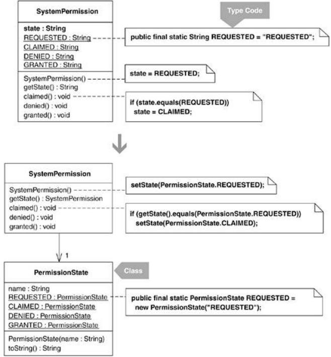

This example, which was shown in the code sketch at the beginning of this refactoring and mentioned in the Motivation section, deals with handling permission requests to access software systems. We'll begin by looking at relevant parts of the class, SystemPermission:

public class SystemPermission {
   private String state;
   private boolean granted;

   public final static String REQUESTED = "REQUESTED";
   public final static String CLAIMED = "CLAIMED";
   public final static String DENIED = "DENIED";
   public final static String GRANTED = "GRANTED";

   public SystemPermission() {
      state = REQUESTED;
      granted = false;
   }

   public void claimed() {
      if (state.equals(REQUESTED))
         state = CLAIMED;
   }

   public void denied() {
      if (state.equals(CLAIMED))
         state = DENIED;
   }

   public void granted() {
      if (!state.equals(CLAIMED)) return;
      state = GRANTED;
      granted = true;
   }

   public boolean isGranted() {
      return granted;
   }

   public String getState() {
      return state;
   }
}

## step1-2
The type-unsafe field in SystemPermission is called state. It is assigned to and compared against a family of String constants also defined within SystemPermission. The goal is to make state type-safe by making its type be a class rather than a String.

I begin by self-encapsulating state:

public class SystemPermission...
   public SystemPermission() {
      
setState(REQUESTED);
      granted = false;
   }

   public void claimed() {
      if (
getState().equals(REQUESTED))
         
setState(CLAIMED);
   }

   
private void setState(String state) {
      
this.state = state;
   
}

   public String getState() {  // note: this method already existed
      return state;
   }

   // etc.

This is a trivial change, and my compiler and tests are happy with it.

2. I create a new class and call it PermissionState because it will soon represent the state of a SystemPermission instance.

public class PermissionState {
}

## step3
I choose one constant value that the type-unsafe field is assigned to or compared against and I create a constant representation for it in PermissionState. I do this by declaring a public final static in PermissionState that is an instance of PermissionState:

public final class PermissionState {
   
public final static PermissionState REQUESTED = new PermissionState();
}

I repeat this step for each constant in SystemPermission, yielding the following code:

public class PermissionState {
   
public final static PermissionState REQUESTED = new PermissionState();
   
public final static PermissionState CLAIMED = new PermissionState();
   
public final static PermissionState GRANTED = new PermissionState();
   
public final static PermissionState DENIED = new PermissionState();

}

The compiler accepts this new code.

Now I must decide whether I want to prevent clients from extending or instantiating PermissionState in order to ensure that the only instances of it are its own four constants. In this case, I don't need such a rigorous level of type safety, so I don't define a private constructor or use the final keyword for the new class.