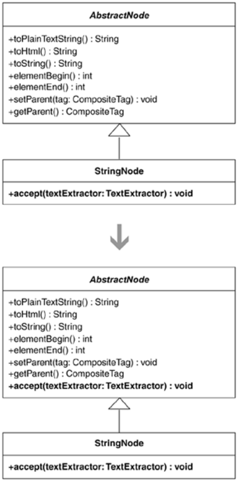

To process objects polymorphically, the classes of the objects need to share a common interface, whether a superclass or an actual interface. This refactoring addresses the case when a superclass or interface needs to have the same interface as a subclass.

I came across the need for this refactoring on two separate occasions. Once when I was applying Move Embellishment to Decorator (144), an emerging Decorator [DP] needed the same interface as a subclass. The easiest way to make that happen was to apply Unify Interfaces. Similarly, during an application of the refactoring Move Accumulation to Visitor (320), duplicate code could be removed if certain objects shared the same interface, which Unify Interfaces made possible.

After applying this refactoring on a superclass and subclass, I sometimes apply Extract Interface [F] on the superclass to produce a stand-alone interface. I usually do this when an abstract base class contains state fields and I don't want implementors of the common base class, such as a Decorator, to inherit those fields. See Move Embellishment to Decorator (144) for an example.

Unify Interfaces is often a temporary step on the way to somewhere else. For example, after you perform this refactoring, you may perform a sequence of refactorings that allows you to remove methods you added while unifying your interfaces. Other times, a default implementation of a method on an abstract base class may no longer be needed after applying Extract Interface [F].

I need to unify the interfaces of a subclass called StringNode and its superclass, AbstractNode. StringNode inherits most of its public methods from AbstractNode, with the exception of one method:

public class StringNode extends AbstractNode...
   
public void accept(textExtractor: TextExtractor) {
      
// implementation details…
   
}
}

I add a copy of the accept(…) method to AbstractNode, modifying its body to provide null behavior:

public abstract class AbstractNode...
   
public void accept(textExtractor: TextExtractor) {
   
}

At this point, the interfaces of AbstractNode and StringNode have been unified. I compile and test to ensure that everything works fine. It does.