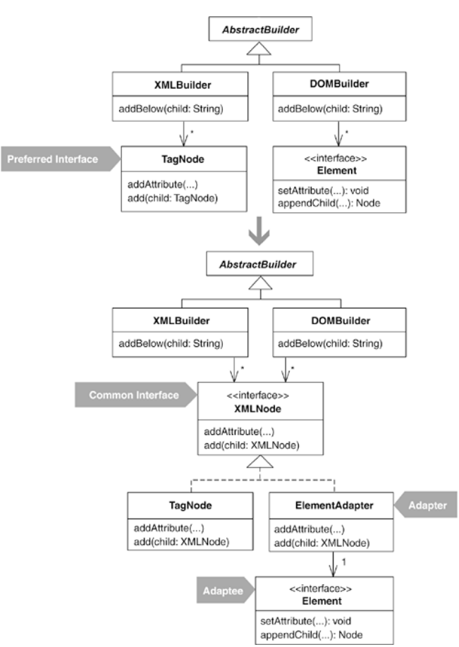
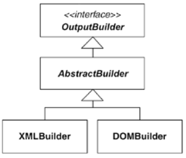

This example relates to code that builds XML (see Replace Implicit Tree with Composite, 178; Encapsulate Composite with Builder, 96; and Introduce Polymorphic Creation with Factory Method, 88). In this case, there are two builders: XMLBuilder and DOMBuilder. Both extend from AbstractBuilder, which implements the OutputBuilder interface:

The code in XMLBuilder and DOMBuilder is largely the same, except that XMLBuilder collaborates with a class called TagNode, while DOMBuilder collaborates with objects that implement the Element interface:

public class DOMBuilder extends AbstractBuilder...
   private Document document;
   private Element root;
   private Element parent;
   private Element current;

   public void addAttribute(String name, String value) {
      current.setAttribute(name, value);
   }

   public void addBelow(String child) {
      Element childNode = document.createElement(child);
      current.appendChild(childNode);
      parent = current;
      current = childNode;
      history.push(current);
   }

   public void addBeside(String sibling) {
      if (current == root)
         throw new RuntimeException(CANNOT_ADD_BESIDE_ROOT);
      Element siblingNode = document.createElement(sibling);
      parent.appendChild(siblingNode);
      current = siblingNode;
      history.pop();
      history.push(current);
   }

   public void addValue(String value) {
      current.appendChild(document.createTextNode(value));
   }

And here's the similar code from XMLBuilder:

public class XMLBuilder extends AbstractBuilder...
  private TagNode rootNode;
  private TagNode currentNode;

  public void addChild(String childTagName) {
     addTo(currentNode, childTagName);
  }

  public void addSibling(String siblingTagName) {
     addTo(currentNode.getParent(), siblingTagName);
  }

  private void addTo(TagNode parentNode, String tagName) {
     currentNode = new TagNode(tagName);
     parentNode.add(currentNode);
  }

  public void addAttribute(String name, String value) {
     currentNode.addAttribute(name, value);
  }

  public void addValue(String value) {
     currentNode.addValue(value);
  }

These methods, and numerous others that I'm not showing in order to conserve space, are nearly the same in DOMBuilder and XMLBuilder, except for the fact that each builder works with either TagNode or Element. The goal of this refactoring is to create a common interface for TagNode and Element so that the duplication in the builder methods can be eliminated.

